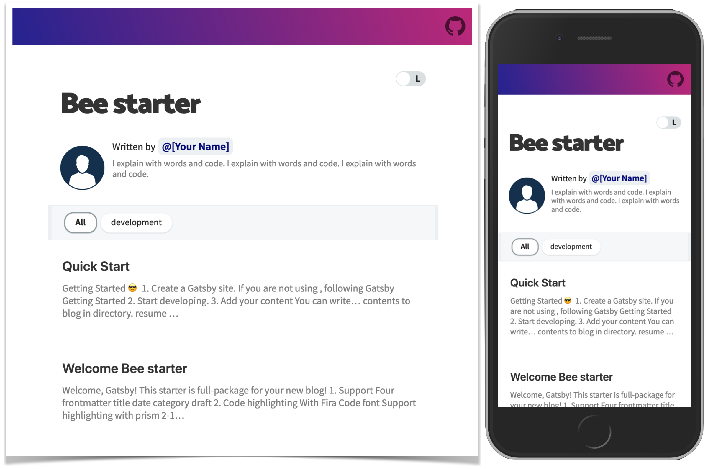

<div align="center">

  

</div>

[](https://github.com/LeeAndJang/L-J-gatsby-blog-starter/actions/workflows/ci.yml)



In this template...

- 💄 Fira Code 폰트로 코드 하이라이팅 기능
- 😄 Emoji 지원
- 🗣 Twitter, Facebook 등 SNS 공유 지원
- 💬 Disqus, utterances 댓글 기능 지원
- ☕ 'Buy me a coffee' 라는 후원 기능
- 🧙 포스트 작성을 위한 CLI 도구 지원
- 🤖 GA 지원
- ⭐ 여러 UX요소 추가
- ⚙ 별도 설정 파일을 통한 블로그 세부 사항 설정 지원

## 😎 Quick Start

### 실행/개발

```sh
npm install
npm run develop
# 브라우저에서 http://localhost:8000 확인
```

### 테스트

```sh
npm test
```

### 빌드

```sh
npm run build
```

> 환경변수는 `.env` 파일을 사용합니다. 필요한 키는 `.env.example` 참고.
