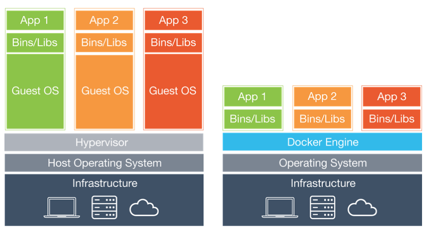
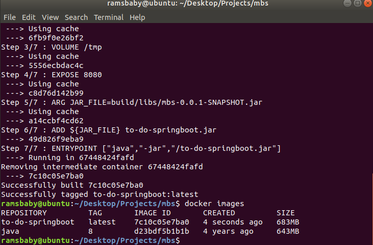
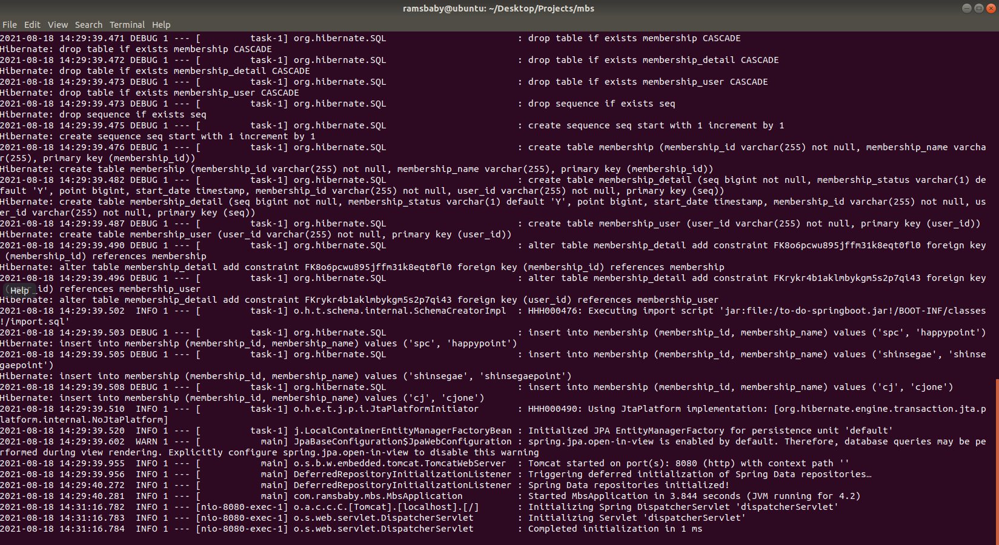
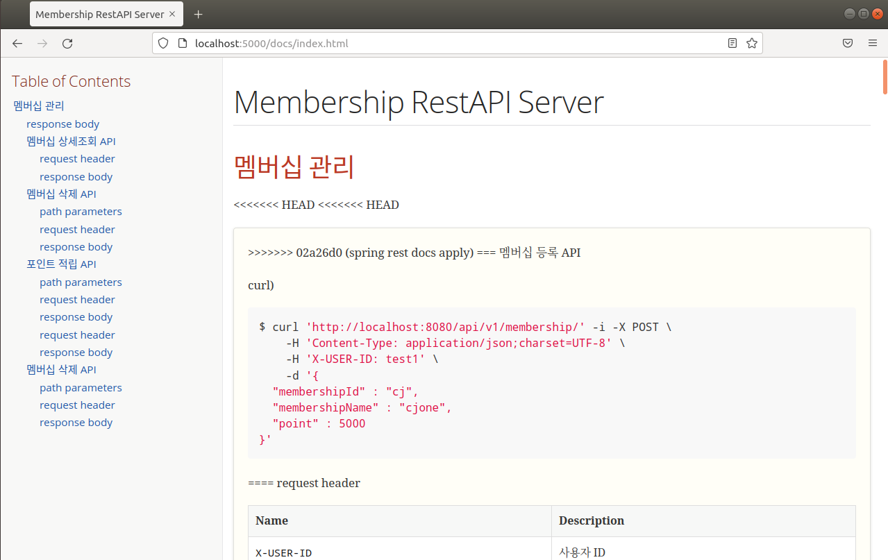

<br>
<br>
<br>
<br>

## 도커란 무엇인가?

우선 도커는 컨테이너 가상화 환경에서 애플리케이션을 관리하고 실행하기 위한 오픈소스 플랫폼입니다.
Go 언어로 만들어졌으며, 리눅스 환경에서 실행가능합니다. 여러 애플리케이션을 묶어서 이미지화 시킬 수도 있고, 단독으로 특정 애플리케이션을 이미지화 시켜서 간단한 도커 명령어를 통해 컨테이너화 시킬 수 있습니다.
도커가 왜 좋은지 알기 위해서는 VM(Virtual Machine)과 비교를 해보면 쉽게 알 수 있습니다.

<br>
<br>
<br>
<br>

## VM VS Docker



간단하게만 짚고 넘어가겠습니다. <br>
우선 VM이란 위 그림의 왼쪽처럼 호스트OS위에 Guest OS 전체를 가상화하여 사용하는 방식입니다. VM은 컴퓨터의 리소스를 분할하여 사용하기 때문에 속도가 느리고, 주변 장치와의 완벽한 호환이 어려운 단점이 존재합니다.
<br><br>
이에 반해 도커는 프로세스를 격리시키는 방식인 `컨테이너` 방식을 사용합니다. 이와 같이 컨테이너 방식을 사용하면 OS전체를 올리는 것이 아니라, 호스트 OS의 프로세스를 공유하기 때문에 VM에 비해 가볍고 빠르게 동작할 수 있습니다. 또한 VM보다 단일 서버에 더 많은 애플리케이션을 배치할 수 있습니다. 즉, `Docker`란 리눅스 컨테이너를 쉽게 사용할 수 있도록 도와주는 도구라고 할 수 있습니다.

<br>
<br>
<br>
<br>

## 도커의 기본 기능

1. 이미지 생성
2. 컨테이너 실행
3. 이미지 배포 및 공유

<br>
<br>
<br>
<br>

## 도커 설치

본격적으로 도커를 설치하고 이미지 생성, 컨테이너 실행을 차례차례 해보겠습니다.<br>
우선 저는 `Ubuntu:18` 환경을 사용하고 있습니다.

우선, 아래 명령어로 도커를 설치하겠습니다.

```script
sudo wget -qO- http://get.docker.com/ | sh
```

설치 후, docker version 명령어를 통해 도커가 정상적으로 설치되었는지 확인해봅시다.

```script
docker version
```

정상적으로 설치가 되었다면, Client 정보와 Server 정보 두가지가 확인되어야 합니다. <br>
Client 정보만 출력되고 있고 Server 정보는 permission denied 되어 있다면

```script
sudo usermod -aG docker #USER  # 혹은 username을 직접 입력합니다.
```

유저에 관한 권한을 변경 후, 재부팅을 하고 다시 확인해봅시다.

<br>
<br>

Docker가 정상적으로 설치되었다면, 이 포스팅의 주제인 스프링부트를 Docker 이미지로 만드는 작업을 해보도록 하겠습니다.

그 전에 도커에서 주로 쓰는 유용한 몇가지 명령어를 알려드리자면,

```script
docker images                         # 도커가 다운로드한 이미지 목록 확인하기
docker pull image_name                # 이미지 다운로드하기 (ex: docker pull ubuntu:18.04)
docker rmi image image_name           # 이미지 삭제하기
docker ps                             # 컨테이너 상태 확인하기
docker ps -a                          # 정지된 컨테이너까지 상태 확인
docker run image_name                 # 컨테이너 생성 후 실행
docker stop container container_name  # 컨테이너 중지하기
docker rm container container_name    # 컨테이너 삭제하기
docker create -i -t centos:7          # 이미지를 컨테이너로 만들기
docker start centos:7                 # 컨테이너 실행하기
docker container prune                # 컨테이너 한번에 다 삭제
```

등이 있습니다.

<br>
<br>
<br>
<br>

## 스프링부트 프로젝트 도커 이미지로 만들기

우선, 도커가 이해할 수 있는 `Dockerfile`이라는 것을 만들어두어야 합니다. 이 Dockerfile은 도커엔진이 이해할 수 있는 명령어들로 이루어져 있습니다.

```script
# Start with a base image containing Java runtime
FROM java:8

# Add Author info
LABEL maintainer="ms6698@naver.com"

# Add a volume to /tmp
VOLUME /tmp

# Make port 8080 available to the world outside this container
EXPOSE 8080

# The application's jar file
ARG JAR_FILE=build/libs/mbs-0.0.1-SNAPSHOT.jar

# Add the application's jar to the container
ADD ${JAR_FILE} to-do-springboot.jar

# Run the jar file
ENTRYPOINT ["java","-jar","/to-do-springboot.jar"]
```

위의 명령어들을 통해 자바8위에서 실행할 것이고, 이미지를 관리하는 사람, 볼륨 디렉토리 지정, 노출할 포트 등을 지정할 수 있습니다.~~(자세한 설명 생략)~~

위의 Dockerfile을 스프링부트 root 디렉토리에 저장한 후, 해당 파일을 리눅스환경으로 옮깁니다.

프로젝트의 root 디렉토리에서 아래의 명령어를 통해 이미지로 만들어 보겠습니다.

```script
docker build -t to-do-springboot .
```



정상적으로 실행이 되어서 to-do-springboot 라는 이미지가 생성이 된것을 확인할 수 있습니다.
이제 이 이미지를 컨테이너로 실행해보겠습니다.

<br>
<br>
<br>
<br>

## 이미지를 컨테이너로 실행

```script
docker run -p 5000:8080 to-do-springboot #
```

`5000:8000`이 의미하는 것은, 내부적으로는 이 어플리케이션이 8080을 사용하고 있으나 5000으로 날아오는 포트는 전부 이 어플리케이션의 8080포트에 맵핑시켜라 라는 뜻입니다.

위의 명령어를 통해 스프링부트가 정상적으로 실행되는 것을 확인할 수 있습니다.



접속도 정상입니다.



<br>
<br>
<br>
<br>

## 마무리

간단하게 도커를 이용하여 스프링부트를 이미지화시키고 컨테이너로 실행하는 과정을 살펴보았습니다.
아무래도 요즘 MSA와 DevOps라는 개념의 등장으로 인해 백엔드 개발자도 도커를 핸들링해야할 경우가 필요해지고 있습니다. <br>

간단한 실습을 통해 Docker의 대략적인 개념을 이해하면서, 깊은 부분은 따로 정리해서 포스팅할 수 있도록 하겠습니다. <br>

다음 포스팅에선 여러 레이어를 묶어서 하나의 통합환경으로 배포할 수 있는 배포 이미지(OS + Nginx + WAS)를 다루어보겠습니다.

<br>
<br>
<br>
<br>

참고 :

> https://imasoftwareengineer.tistory.com/40 <br> https://velog.io/@eugenie8/VM-vs.-Docker <br> https://jungwoon.github.io/docker/2019/01/11/Docker-1.html

<br>
<br>
<br>

#### 읽어주셔서 감사합니다.🖐
