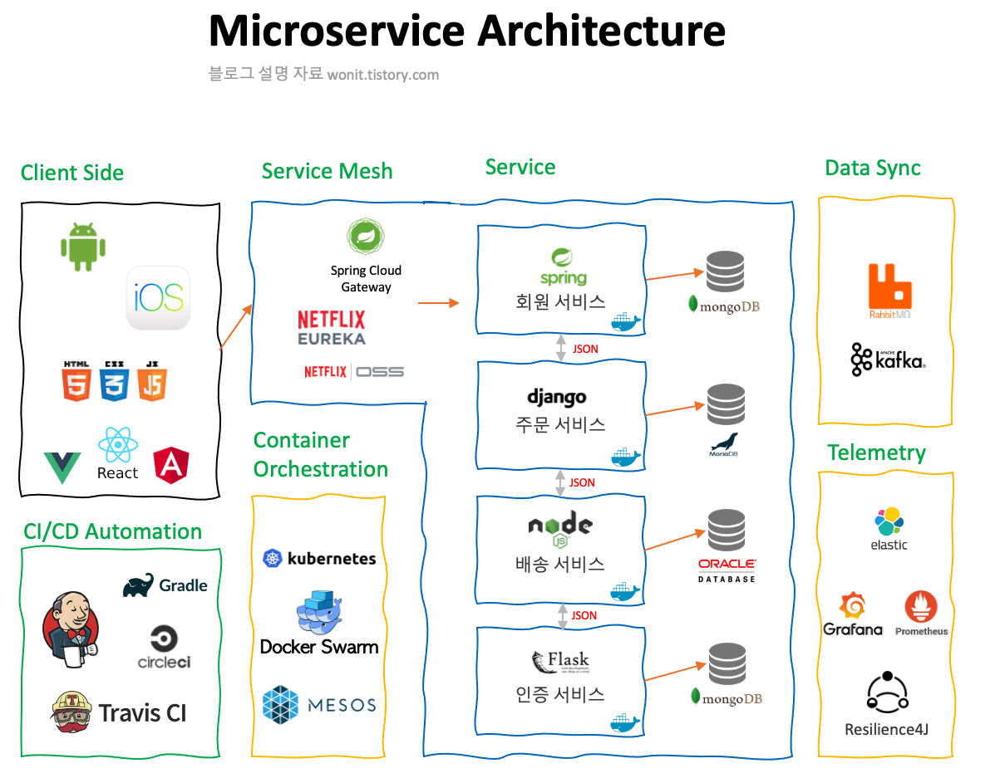

 
 
 

## 서론의 서론

MSA(Micro Service Architecture)를 다루게 되면서 겪었던 의문점들 및 느낀점들을 정리해보려고 합니다. 내용이 조금 길어질 것 같아 여러 포스트로 나누어 진행하게 되었습니다.

1. 서론
   - MSA란 무엇인가?
   - MSA가 자주 언급되는 배경은?
   - MSA를 공부하게 된 이유?
2. 본론
   - MSA와 모놀리식의 차이점?
   - 어떻게 MSA 구조로 사용하고 있는가?
3. 결론
   - MSA로 프로젝트 구성 시 주의할 점
   - 느낀 점

으로 구성하였습니다.

---

 
 

## MSA란 무엇인가?

MSA(Micro Service Architecture)란 
`하나의 큰 어플리케이션을 여러개의 작은 어플리케이션으로 쪼개어 변경과 조합이 가능하도록 만든 아키텍쳐` 라고 할 수 있습니다.

기존의 모놀리식(한 프로젝트내에서 구성) 어플리케이션을 여러개의 마이크로 서비스들로 나누고, 각각을 느슨한 구조로 만들어 RestAPI와 같은 서비스간 가벼운 통신을 통해 데이터 및 요청/응답을 주고 받는 구조입니다. 즉, 마이크로 서비스는 스스로 돌아갈 수 있으며(의존하지 않는 느슨한 구조) 독립적으로 배포가 가능한 서비스라고 할 수 있습니다.

MSA 는 강제하는 방식이 아니기 때문에 각자의 서비스 환경에 맞는 여러가지 형태로 구성될 수 있습니다. 여러개의 엔드포인트가 각자의 마이크로 서비스에 분산되어 있는 형태일 수도 있고, API Gateway같은 앞 단의 최전방 서버를 통해서 단일 엔드포인트 서버로부터 마이크로서비스들을 호출하는 방식 등 다양한 형태로 구현할 수 있습니다.

 
 
 
 

## MSA가 자주 언급되는 배경?

최근 들어 클라이언트 디바이스들이 다양해지고(iOS, Android, 태블릿 등), 빅데이터 등으로 인해 과거와는 다르게 데이터량이 기하급수적으로 늘어남에 따라 어플리케이션은 점차 무거워지게 되었습니다. 여러 개발자들이 한 프로젝트에서 작업하다 보니 스파게티 코드도 늘어날 뿐더러, 실 사용자가 사용하는 운영 시스템에 서비스가 배포되려면 굉장히 많은 시간이 소요되게 되었습니다.

이러한 문제점들을 극복하기 위해 아마존, 넷플릭스 와 같은 거대 IT기업들 사이에서 MSA 구조를 적용하였고, 실제로도 MSA 구조로의 전환과정을 널리 알리는 IT 공룡기업들의 기술력 어필 과정에서 MSA 구조는 차츰 주목받기 시작하였습니다.

아마존과 넷플릭스가 MSA 구조를 도입하여 좋은 효과를 내기 시작하자, 서비스 규모가 큰 국내IT기업들도 앞다투어 적용하기 시작하였습니다. 저는 특히 [11번가에서 제작한 MSA 전환기](https://www.youtube.com/watch?v=J-VP0WFEQsY&feature=youtu.be)를 아주 재미있게 보았습니다. [배달의민족 마이크로서비스 여행기](https://www.youtube.com/watch?v=BnS6343GTkY) 등등

 
 
 
 

## MSA를 공부하게 된 이유?

대학교때 배우던 JAVA만 생각하고 있다가 처음 Spring Framework를 맞닥뜨렸을 때 느꼈던 거대한 벽처럼, 모놀리식 구조에서만 개발하던 저는, 지금의 회사로 이직을 한 후 MSA구조를 처음 맞닥뜨리고 상당한 충격을 받았습니다.

당시의 저는 mysql/oracle만 사용했었기 때문에 각각의 마이크로 서비스 환경에 맞는 여러가지 DB를 접하게 된 것, 안정적인 서버 간 통신을 위한 여러가지 고려사항, 마이크로 서비스들마다 다른 여러가지 배포 전략, MSA를 효율적으로 사용하기 위한 AWS 클라우드 서비스 등을 마주하고서 **심란한 나날**들을 보냈던 기억이 아직도 생생합니다. ~~그때는 매일매일 출근하기가 두렵고, 항상 우울했습니다...~~

  

#### [2-1편에서 계속](https://ramsbaby.netlify.app/Etc/etc-post9-2/)

  

참고 :

> https://brunch.co.kr/@maengdev/3   https://www.samsungsds.com/kr/insights/msa_architecture_edm.html   https://www.msaschool.io/

 
 
 

#### 읽어주셔서 감사합니다.🖐
