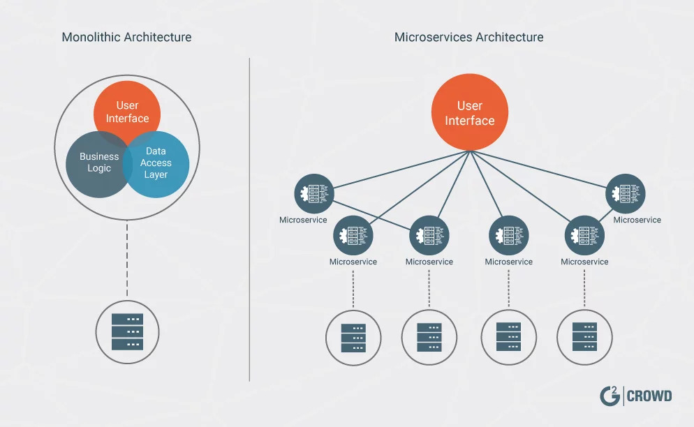

 
 
 
 

## MSA와 모놀리식의 차이점?

모놀리식이라는 표현이 원래부터 존재했었던게 아니라, MSA(Micro Service Architecture) 개념이 생겨나면서부터 전통의 아키텍쳐를 지칭하기 위해서 생겨난 단어로 알고 있습니다.

--- 

### 모놀리식 구조

 모놀리식 아키텍쳐는 한마디로 한 프로젝트 내에서 UI, 비즈니스로직, DB Handler 등이 한데 모여있는 구조입니다. 모놀리식 구조는 내부 모듈간 Dependency 가 MSA 구조 대비 강할 수 밖에 없습니다. 즉 Coupling이 강력하게 유지됩니다.

#### 장점 : 

- 단순한 구조, 개발의 용이함.
- 테스트 코드 작성 용이함.
- MSA 대비 운영이 용이함.
- 내부 메소드 호출이기 때문에 네트워크를 통한 API 호출 대비 작은 구조에서는 성능이 좋음.
- 트랜잭션 관리가 용이

#### 단점 : 

- 규모가 커질수록 복잡도가 심각하게 증가.
- 유지보수가 어려워짐.
    - 결합도가 강력하므로 지엽적인 코드 분석을 위해 전체를 분석해야 할 경우도 생김
- 배포의 어려움(장애가 났을 시 즉시 적용이 쉽지 않음)
- SPOF(Single Point of Failure, 한 부분의 장애로 전체서비스가 장애가 날 수 있는 포인트)가 너무 큼.
- 서비스/기능 별 적합한 언어 및 프레임워크를 채택하기가 어려움.
    
    

---

### MSA(Micro Service Architecture) 구조

#### 장점 : 

- 서비스별로 시스템이 독립적이기 때문에, 하나의 기능을 개발할 때 봐야할 코드 수도 적고, 이해하기 쉽다. → 유지보수하기 편하다
- 서비스가 독립적이기 때문에 장애 및 수정사항이 발생했을 경우 빌드 및 배포가 편하다
- 기능 별 적합한 언어 및 프레임워크를 선택할 수 있다.
- 서비스별 확장성에 용이함(주로 SaaS 제품 회사가 MSA를 택하는 이유, 트래픽이 몰리는 서비스만 Scale-out 가능)
- 서비스별 독립적이기 때문에 신기술 적용에 용이

#### 단점 :

- 구현 복잡도가 증대
- 트랜잭션 관리 복잡(보상 트랜잭션, Saga 패턴 적용 고려)
- 테스트코드 구현 복잡
- 서비스 간 Dependency가 있는 경우 릴리즈가 복잡(ex. Nexus)

---

그렇다고 모놀리식이 걷어내야할 레거시, 안티 패턴은 절대 아닙니다. 경우에 따라 충분히 모놀리식도 좋은 효율을 낼 수 있습니다. 하지만 급변하는 비즈니스 상황에 유연하게 대처할 수 있는 구조는 MSA구조이기 때문에 많은 회사들이 MSA 구조를 택하고 있는 것은 사실입니다.

  

#### [2-2편에서 계속](https://ramsbaby.netlify.app/Etc/etc-post9-3/)
  

참고 :

> https://brunch.co.kr/@maengdev/3   https://www.samsungsds.com/kr/insights/msa_architecture_edm.html   https://www.msaschool.io/

 
 
 

#### 읽어주셔서 감사합니다.🖐
