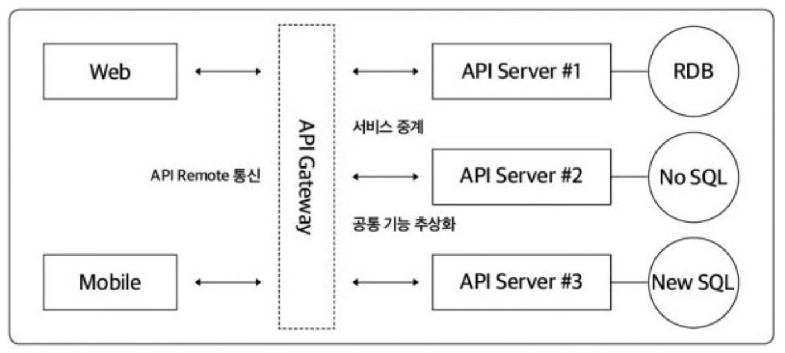
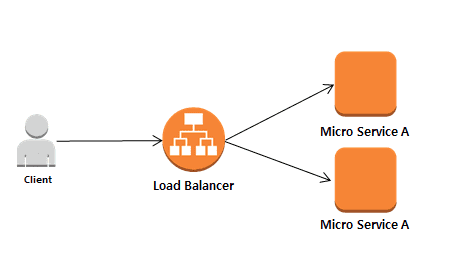
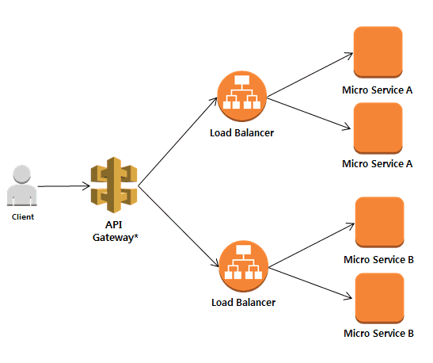
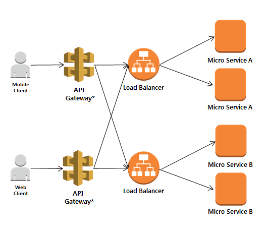

 
 
 
 

## 어떻게 MSA 구조를 사용하고 있는가?

 
 

앞서 말했듯, MSA 구조에 정답은 없지만 서비스 형태별로 유용한 구조는 몇가지 있습니다.

사실 다른 회사에서 어떤식으로 적용하고 있는지도 잘 모르지만, CSP(Cloud Solution Provider)에서 제공하는 서비스를 통해서 클라우드 상품을 개발하는 경우에는 아마 API Gateway 방식을 많이들 적용할 것 같습니다.

---

API Gateway란?

 
 

MSA 구조에서 `API 게이트웨이`는 클라이언트에서 백엔드 서버들 사이에 있는 미들웨어 성격을 가지고 있습니다. API Gateway는 API 서버로 넘어오는 요청들의 접근 제어 및 트래픽을 모니터링하고 보안 기능을 제공하며, 전체적인 마이크로 서비스를 보호하는 유입점을 담당합니다. API에 대한 인증/인가 기능을 가지고 있으며, 메시지의 내용에 따라 어플리케이션 내부에 있는 마이크로 서비스로 라우팅하는 역할도 담당합니다.

 
 

### MSA 서비스 호출 패턴

마이크로서비스에서 서비스 호출 패턴이 API Gateway 방식만 있는 것은 아닙니다.

- LoadBalancer To Microservice 방식
  

 
 

- API Gateway To MicroService 방식
  

 
 

- API Gateway + BFF(Backend For Frontend) 방식
  

 
 

등의 방식들이 있습니다. [관련글 MSA SCHOOL](https://www.msaschool.io/operation/architecture/architecture-one/)

---

## API Gateway의 주요 기능

### 1. 인증 및 인가

1. 인증이란 유저가 누구인지 확인하는 절차, 인가란 어떠한 자원에 인증받은 유저가 접근할 때 권한이 있는지 확인하는 절차입니다.
2. 각각의 마이크로 서비스들이 요청을 받을 때 인증/인가 절차를 따로 처리한다면, 인스턴스들마다 같은 소스코드를 심어주어야 할 것입니다. 유지 보수가 어려워짐은 물론, 로깅 및 모니터링도 아주 힘들어질 것입니다.
3. 인증서관리, 인증, SSL, 프로토콜 변환 등과 같은 기능을 API Gateway에 일임함으로써 각각의 마이크로 서비스들의 부담을 줄이고 관리포인트를 한 곳에 모으는 효과를 볼 수 있습니다.

 

### 2. 다수의 요청들을 단일 요청으로 축소 가능

1. 여러 내부 마이크로 서비스를 대상으로 하는 여러 클라이언트의 요청들을 단일 클라이언트 요청으로 집계할 수 있습니다.
2. 이를 통해 클라이언트앱과 백엔드 API간에 통신량을 줄임으로써 대기시간을 줄여 성능상의 이점이 발생합니다.
3. 클라이언트에서 어느 마이크로서비스 인스턴스로 요청을 보낼지 고민하지 않아도 됩니다.
4. 백엔드 마이크로서비스의 복잡도를 외부에 노출하는 것이 아닌, 숨길 수 있게 됩니다.

 

### 3. API 라우팅

API 라우팅 기능을 이용해 다음과 같은 서비스가 가능합니다.

- 로드 밸런싱(Load Balancing)
- 서비스 및 클라이언트 별 엔드포인트 라우팅
- 메시지 혹은 헤더 기반 라우팅

 

### 4. 로깅

- API 호출시 API 게이트웨이는 공통적으로 호출되는 서비스이므로 모든 로그를 중간에서 수집하기 좋습니다.
- API 호출 로그는 사용자 사용 패턴 분석이나 문제 발생시 문제를 추적하기 위한 자료로 사용됩니다.

---

## API Gateway 적용 시 고려해야 할 사항

1. API Gateway의 Scale-out이 문제가 생길 경우 모든 Reqeust에 대한 병목지점이 될 위험이 있습니다.
2. API Gateway라는 추가적인 계층이 만들어지는 것이므로 그만큼 네트워크 latency와 SPOF(장애유발지점)가 증가합니다.
   2-1. API Gateway는 마이크로 서비스들의 최전방에 존재하기 때문에 최대한 가볍게 설계되어야 합니다. 무거워진 API gateway로 인해 모든 서비스들의 Latency가 증가될 수 있기 때문입니다.
3. API Gateway와 내부 마이크로 서비스들간의 결합도가 증가하게 됩니다.

  

#### [3편에서 계속](https://ramsbaby.netlify.app/Etc/etc-post9-4/)

  

참고 :

> https://brunch.co.kr/@maengdev/3   https://www.samsungsds.com/kr/insights/msa_architecture_edm.html   https://www.msaschool.io/

 
 
 

#### 읽어주셔서 감사합니다.🖐
