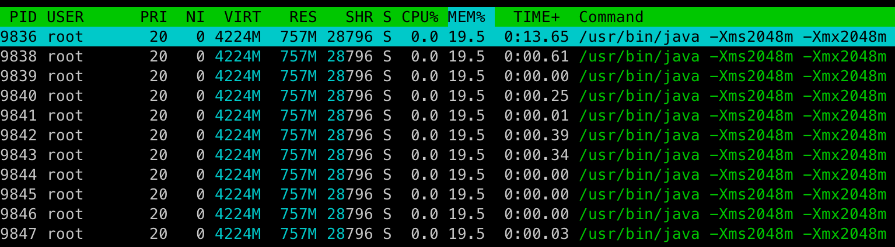
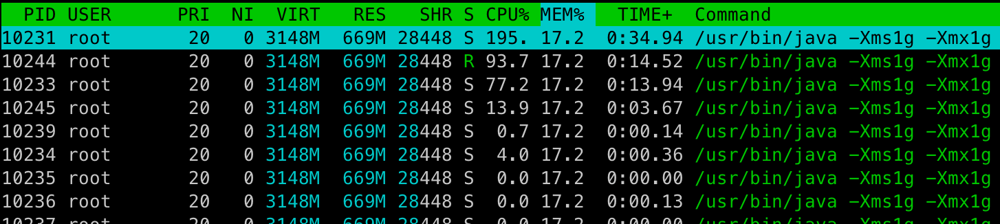
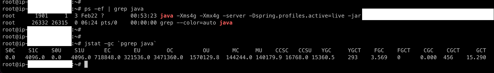

 
 

 
 

## 서론

OOM Killer에 의해 자바 프로세스가 예기치 않게 다운되는 현상이 발생하였습니다.

메모리 바운더리 설정을 하지 않은 자바 프로세스가 리눅스 OOM Killer에 의해 다운되었다고 생각했으나, 분명 해당 자바 프로세스는 메모리 설정이 되어있는 상태였습니다.

자바 프로세스에 -Xms, -Xmx 옵션을 통해 힙메모리를 부여하였으나, 여전히 프로세스 다운현상이 발생하였고, 프로세스의 메모리를 확인해 보았을때, 부여한 옵션값과는 다르게 적용된 것처럼 보이는 현상이 발생하였습니다.

회사의 다른 자바 프로세스들의 힙메모리를 확인해봐도 제가 생각한 -Xms, -Xmx 옵션을 통한 메모리 바운더리와 실제 메모리 바운더리가 일치하지 않았습니다.

자바 프로세스의 힙메모리 설정에 대한 의문이 생기게 되었고, 왜 예상과 달리 동작하는지 확인해보았습니다.

 
 
 
 

## 의문점

1. 실제 -Xms 로 할당한 최소힙메모리보다 사용중인 실제 메모리가 작은 이유??
     
2. -Xms300m을 잡아도 free -h 로 확인해보니 할당된 메모리는 100m??
     
3. -Xmx로 할당한 최대힙메모리가 실제로 적용되고 있는가??
     
4. jdk8버전 이후부터 바뀐 메모리구조로 인해 어떠한 설정을 추가적으로 해야 하는가?

 
 
 
 

## 확인결과

#### 1. 실제 -Xms 로 할당한 최소 힙메모리보다 사용중인 실제 메모리가 작은 이유??

- free -h , 혹은 htop(res) 을 통해 확인하는 메모리는 프로세스의 물리적인 메모리.

- 자바옵션으로 주어지는 힙메모리(-Xms, -Xmx)는 가상메모리를 할당하는 것.

- 실제로 객체가 생성되어 힙에 올라가기 전까지 물리메모리가 증가하지는 않음.

  a. -Xms2g, -Xmx2g일 경우의 가상메모리는 총 4224m으로 잡혀있음(힙메모리+Native 메모리) 
   
   
  b. -Xms1g, -Xmx1g일 경우의 가상메모리는 총 3148m으로 잡혀있음(힙메모리+Native 메모리) 

 
 
 

#### 2. -Xmx로 할당한 최대힙메모리가 실제로 적용되고 있는가??

최대힙메모리는 4g가 주어져 있는 상황. 실제로 4g가 할당되어 있을까?

jstat 명령어를 통해 gc가 이루어지고 있는 메모리 region들의 할당크기와 사용량을 확인해보면,

4096 + 718848 + 347136 = 4,194,304 KByte = 4 GByte, 정확하게 4G가 나온다. **잘적용되고있음.**

 
 
 

#### 3. JDK8 이 후 바뀐 메모리구조로 인해 어떠한 설정을 추가적으로 해야 하는가?

- jdk1.7의 이전버전들과 다르게 1.8이후부터는 Permanent 영역이 Metaspace로 바뀌게 되었고, 이 영역은 OS의 사용가능 메모리를 JVM에게 동적으로 전달해준다고 합니다.
    
- [JDK8 적용 후, 심각한 성능저하가 발생한다면?](https://brunch.co.kr/@heracul/1)   
  a. 해당 블로그에 MaxMetaspaceSize 설정을 통해 최댓값을 정해놓지 않으면 심각한 위험 혹은 성능저하가 나타난다고 합니다.   
  b. MaxMetaspaceSize를 지정하지 않게 되면, JVM의 Old 영역이 가득차게 되면서, heap이 가득차고 minor gc가 반복되면서 JVM의 성능저하가 발생합니다.   
  c. 즉, Old영역의 GC조건이 성립되지 않기 때문에 메모리 반환이 제때 이루어지지 않았습니다.  
  d. MaxMetaspaceSize에 메모리가 도달해야, 클래스들에 대한 metadata를 메모리에서 release하게 되는데, 해당 설정이 없으면 적절한 Full GC가 발생하지 않는다는 결론에 도달했습니다.

 
 
 
 

## 결론

- jdk1.8 이후에 MaxMetaspaceSize를 설정하여 위험상황(oom killer에 의한 프로세스다운)을 회피하여야 하며
  -Xms, -Xmx 설정을 통해 힙메모리 바운더리를 적절하게 지정하자.   

- 힙메모리가 크다고 무조건 좋은게 아니다.   

- 힙메모리가 클수록 fullGC 속도가 느림. → 대용량 건에 안전/유리 → batch 서비스   

- 힙메모리가 작을수록 fullGC 속도가 빠름. → 응답 반응성에 유리 → api 서비스   

- trade-off가 발생, 적당히 선택할 것.   

참고 :

> https://brunch.co.kr/@heracul/1

 
 

#### 읽어주셔서 감사합니다.🖐
