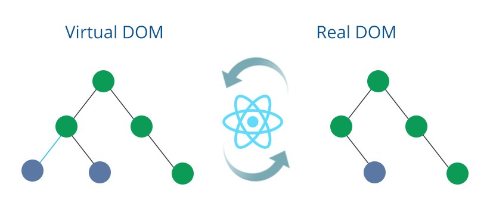

<br>
<br>
<br>
<br>

## 리액트란 무엇인가?

리액트의 정의에 대해서 짚고 넘어가겠습니다.<br>

> 리액트란 웹 프레임워크로, 자바스크립트 라이브러리 중의 하나로 사용자 인터페이스를 만들기 위해 사용된다. (출처: 위키백과)

React.js는 facebook에서 만든 오픈소스 프로젝트로 싱글페이지 어플리케이션이나 모바일 애플리케이션의 개발 시 토대로 사용될 수 있는 프론트엔드 라이브러리라고 볼 수 있습니다.

스프링으로 치면 MVC의 V(View)를 개발할 수 있도록 도와주는 라이브러리라고 생각합시다.

<br>
<br>
<br>
<br>
<br>
<br>

## 리액트의 비밀

프로그램이 사용자에게서 어떤 작업을 받으면 Controller는 모델 데이터를 조회하거나 수정하고, 변경된 사항을 뷰에 반영합니다.

반영하는 과정에서 보통 뷰를 변형(mutate)합니다. 이러한 작업이 어플리케이션의 규모가 크면 상당히 복잡해지고 제대로 관리되지 않으면 성능도 떨어질 수 있습니다.

페이스북 개발 팀은 이를 해결하려고 하나의 아이디어를 고안해 냈는데, 어떤 데이터가 변할 때마다 어떤 변화를 줄지 고민하는 것이 아니라 그냥 기존 뷰를 날려버리고 처음부터 새로 렌더링하는 방식입니다.

'초기 렌더링'과 '리랜더링' 상태를 비교하는 것이 핵심입니다. 자바스크립트를 사용하여 두 가지 뷰를 최소한의 연산으로 비교한 후, 둘의 차이를 알아내 최소한의 연산으로 DOM(Document Object Model) 트리를 업데이트하는 것이 비밀의 열쇠입니다.

> 여기서 DOM(Document Object Model) 이란 개발자가 작성한 HTML, javascript 소스를 브라우저가 파싱한 것을 의미합니다.
> 다른말로 바꿔말하면, HTML 태그들을 javascript 가 해석할 수 있는 객체로 만든 것이 DOM입니다.

결국 방식 자체는 루트 노드부터 시작하여 전체 컴포넌트를 처음부터 다시 렌더링하는 것처럼 보이지만, 사실 최소한의 비용으로 최적의 효과를 낼 수 있는 방식입니다.

위에서 이야기한 '리랜더링' 뷰가 바로 리액트의 주요 특징 중 하나인 Virtual DOM입니다.

<br>
<br>

### Virtual DOM



이러한 Virtual DOM은 이벤트가 발생할 때마다 새롭게 만들어집니다. 그리고 뷰를 다시 그릴 때마다 실제 DOM과 비교하고 전후 상태를 비교해, 변경이 필요한 최소한의 변경사항만 실제 DOM에 반영해
앱의 효율성과 속도를 개선할 수 있다고 합니다.

<br>
<br>

### Props and State

- Props<br>
  Props란 부모 컴포넌트에서 자식 컴포넌트로 전달해 주는 데이터를 말합니다.
  쉽게 읽기 전용 데이터라고 생각하면 될 것 같습니다.
  자식 컴포넌트에서 전달받은 props는 변경이 불가능하고 props를 전달해준 최상위 부모 컴포넌트만 props를 변경할 수 있습니다.

- State<br>
  State는 컴포넌트 내부에서 선언하며 내부에서 값을 변경할 수 있습니다. state는 동적인 데이터를 다룰 때 사용하며, 사용자와의 상호작용을 통해 데이터를 동적으로 변경할 때 사용합니다.
  일반적으로 변수라고 생각할 수도 있지만, state 값이 변경되면 뷰의 렌더링도 함께 변하게 된다는 특징이 있습니다.

<br>
<br>

### JSX

JSX란 자바스크립트와 HTML 태그가 공존하는, 리액트에서만 사용되는 문법입니다.

```javascript
    const helloTitle = <h1>Welcome to React World!<h1>;
```

리액트는 마크업과 로직을 분리하는 대신 둘 다 포함하는 '컴포넌트'라고 부르는 느슨하게 연결된 유닛으로 관심사를 분리합니다.

리액트는 JSX 사용이 필수가 아니지만, 대부분의 사람들은 Javascript 코드 안에서 UI 관련 작업을 할 때 시각적으로 더 도움이 된다고 생각합니다.

JSP에 익숙한 자바개발자 같은 경우에는 아주 낯설게 느껴지기도 할것입니다. 저도 그랬었구요.😢

<br>
<br>
<br>
<br>
<br>
<br>

## 실제 코드로 리액트 훑어보기

<br>
<br>

### Hooks

Hooks는 리액트 v16.8에 새로 도입된 기능으로 함수형 컴포넌트에서도 상태 관리를 할 수 있는 `useState`, 
렌더링 직후 작업을 설정하는 `useEffect` 등의 기능을 제공하여 기존의 함수형 컴포넌트에서 할 수 없었던 다양한 작업을 할 수 있게 해줍니다.

<br>
<br>

#### useState

useState는 가장 기본적인 Hook이며, 함수형 컴포넌트에서 상태를 관리해야 한다면 이 Hook을 사용하면 됩니다.
useState 함수의 파라미터에는 상태의 기본값을 넣어 줍니다.
하나의 useState 함수는 하나의 상태 값만 관리할 수 있습니다. 
컴포넌트에서 관리해야 할 상태가 여러 개라면 useState를 여러 번 사용하면 됩니다.

```javascript
import React, { useState } from 'react'
const Counter = () => {
  const [value, setValue] = useState(0)

  return (
    <div>
      <button onClick={() => setValue(value + 1)}>+1</button>
    </div>
  )
}
```

<br>
<br>

#### useEffect

useEffect는 리액트 컴포넌트가 렌더링될 때마다 특정 작업을 수행하도록 설정할 수 있는 Hook입니다.
컴포넌트가 렌더링 될 때마다 호출되는 셈이죠.

useEffect는 기본적으로 렌더링되고 난 직후마다 실행되며, 두 번째 파라미터 배열에 무엇을 넣는지에 따라 실행되는 조건이 달라집니다.

```javascript
//name이 바뀔때마다 console을 찍어라
useEffect(() => {
  console.log(name)
}, [name])
```

<br>
<br>

#### useReducer

useReducer는 useState보다 더 다양한 컴포넌트 상황에 따라 다양한 상태를 다른 값으로 업데이트해 주고 싶을 때 사용하는 Hook입니다.
useReducer는 현재 상태, 그리고 업데이트를 위해 필요한 정보를 담은 액션(action) 값을 전달받아 새로운 상태를 반환하는 함수입니다.
첫번째 파라미터인 state를 받아들여서 새로운 state로 업데이트 쳐주는 함수라고 이해하면 쉽습니다. 함수에서 새로운 상태를 만들 때는 반드시 불변성을 지켜 주어야 합니다.

> 여기서 불변성이란 말 그대로 변하지 않는 속성입니다.
> 기존의 값을 직접 수정하지 않으면서 새로운 값을 만들어 내는 것을 '불변성을 지킨다'고 합니다
> 불변성이 지켜지지 않으면 객체 내부의 값이 새로워져도 바뀐 것을 감지하지 못합니다.
> 그렇게 되면 컴포넌트를 export 할때 React.memo(리렌더링 방지 기법)에서 서로 비교하여 최적화하는 것이 불가능
> 조금 비용이 발생하더라도, 깊은 복사를 통해서 불변성을 유지해주어야 리액트의 성능에 문제가 발생하지 않습니다. 하지만 immutable, immer 등의 라이브러리를 통해 코드를 늘리지 않고 불변성을 유지하는 방법도 존재합니다.

```javascript
function reducer(state, action) {
  // action.type에 따라 다른 작업 수행
  switch (action.type) {
    case 'INCREMENT':
      return { value: state.value + 1 }
    case 'DECREMENT':
      return { value: state.value - 1 }
    default:
      // 아무것도 해당되지 않을 때 기존 상태 반환
      return state
  }
}

const [state, dispatch] = useReducer(reducer, { value: 0 })
```

useReducer를 사용했을 때의 가장 큰 장점은 컴포넌트 업데이트 로직을 컴포넌트 바깥으로 빼낼 수 있다는 것입니다.

<br>
<br>

#### useMemo

useMemo를 사용하면 함수형 컴포넌트 내부에서 발생하는 연산을 최적화할 수 있습니다.
useMemo는 렌더링하는 과정에서 특정 값이 바뀌었을 때만 연산을 실행하고, 원하는 값이 바뀌지 않았다면 이전에 연산했던 결과를 다시 사용하는 방식입니다.
변수값이 변해야만 함수가 호출되는 특징이 있습니다.
useMemo는 컴포넌트가 렌더링 될 때, 업데이트가 필요없는 불필요한 컴포넌트까지 같이 리랜더링하는 경우를 방지할 수 있습니다.
컴포넌트 최적화에 꼭 필요한 Hook입니다.

```javascript
    const count = useMemo(() => countLiveUsers(users),[users]))
```

위의 코드에서 useMemo를 사용하지 않았다면 예를 들어, input tag에 값을 넣는동안에도 계속 불필요한 리랜더링이 일어날 것입니다.
users가 바뀌어야만 countLiveUsers 함수가 호출하게끔 도와주는 녀석이 useMemo입니다.

<br>
<br>

#### useCallback

useCallback은 useMemo와 상당히 비슷합니다. 렌더링 성능을 최적해해야 하는 상황에서 사용합니다.
useCallback은 리액트에서 이벤트 핸들러 함수를 필요로 할 때 사용하는 hook 입니다.

useCallback의 첫 번째 파라미터에는 생성하고 싶은 함수를 넣고, 두 번째 파라미터에는 배열을 넣으면 됩니다.
이 배열에는 어떤 값이 바뀌었을 때 함수를 새로 생성해야 하는지 명시해야 합니다.

숫자, 문자열, 객체처럼 일반 값을 재사용하려면 useMemo를 사용하고, 
함수를 재사용하려면 useCallback을 사용하면 됩니다.

참고로 다음 두 코드는 완전히 똑같은 코드입니다.

```javascript
useCallback(() => {
  console.log('hello world!')
}, [])

useMemo(() => {
  const fn = () => {
    console.log('hello world!')
  }
  return fn
}, [])
```

<br>
<br>

#### useRef

useRef Hook은 함수형 컴포넌트에서 ref를 쉽게 사용할 수 있도록 해 줍니다.(ref란 리액트에서 DOM에 이름을 다는 방법입니다.)
useRef를 사용하여 ref를 설정하면 useRef를 통해 만든 객체 안의 current 값이 실제 엘리먼트를 가리킵니다.
추가로 컴포넌트 로컬 변수를 사용해야 할 때도 useRef를 활용할 수 있습니다.

```javascript
const inpulEl = useRef(null);

...

inputEl.current.focus(); // input 태그를 가리킴

...

return (
    <div>
        <input value={number} onChange={onChange} ref={inputEl}>
    </div>
)
```

<br>
<br>
<br>
<br>
<br>
<br>

## 리액트의 컴포넌트 스타일링 방식

- 일반 CSS: 컴포넌트를 스타일링하는 가장 기본적인 방식입니다.<br>
- Sass: 자주 사용되는 CSS 전처리기(pre-processor) 중 하나로 확장된 CSS 문법을 사용하여 CSS 코드를 더욱 쉽게 작성할 수 있도록 해 줍니다.<br>
- CSS Module: 스타일을 작성할 때 CSS 클래스가 다른 CSS 클래스의 이름과 절대 충돌하지 않도록 파일마다 고유한 이름을 자동으로 생성해 주는 옵션입니다.<br>
- styled-components: 스타일을 자바스크립트 파일에 내장시키는 방식으로 스타일을 작성함과 동시에 해당 스타일이 적용된 컴포넌트를 만들 수 있게 해 줍니다.<br>

<br>
<br>
<br>
<br>

## ContextAPI

리액트에서 전역적인 상태를 관리하기 위한 도구는 여러가지가 있습니다. `Redux`, `MobX` 등이 있지만 공식 리액트 릴리즈에서 제공하는 방식도 있습니다.
바로 React ContextAPI입니다.


이러한 전역적인 상태관리를 사용하지 않으면 자식 컴포넌트로 값을 변경해주기 위해선 계속 타고타고 들어가는 형태로, 비효율적인 props 전달이 이루어집니다.
대규모 컴포넌트 구조에서는 아주 비효율적이겠지요.

바로 ContextAPI를 이용하면 건너건너 데이터를 넘기는 것이 아니라, 직접, 그리고 전역적으로 상태나 함수를 전달/관리해 줄 수 있습니다.

Context 는 createContext라는 함수를 이용해서 만들며, provider를 통해 컴포넌트를 감싸준 상태에서, 사용하고자 하는 곳에서는 useContext()를 이용해 호출하여 사용가능합니다.

<br>
<br>

- **Context 만들기**

```javascript
//GlAuthContext.js
const GlAuthContext = createContext({
  state: {
    loginCheck: false,
    users: '',
    pageviews: '',
    sessions: '',
    gci: '',
  },
  actions: {
    setLoginCheck: () => {},
    setUsers: () => {},
    setPageviews: () => {},
    setSessions: () => {},
    setGci: () => {},
    goToDashboard: loginCheck => {
      alert(loginCheck)
    },
  },
})
```

<br>
<br>

- **사용할 Component에 Provider 제공**

```javascript
import { GlAuthProvider } from './GlAuthContext'

//context를 사용할 컴포넌트 provider로 감싸주기(보통 최상위 컴포넌트에 사용합니다.)
return (
  <GlAuthProvider>
    <div className={classes.wrapper}>...생략...</div>
  </GlAuthProvider>
)
```

<br>
<br>

- **Component에서 Context 사용**

```javascript
//context를 실제로 사용하는 컴포넌트
const { state, actions } = useContext(GlAuthContext)
console.log(state.users)
```

<br>
<br>
<br>
<br>
<br>
<br>

## 마무리

이밖에도 물론 수많은 리액트를 다루는 기술들이 있으나,
이번 포스팅은 리액트 간략소개 정도로 글을 마무리 짓고,
다른 포스팅에서 리액트의 심화편으로 찾아뵙겠습니다.

<br>
<br>
<br>
<br>

참고 :

> '리액트를 다루는 기술(길벗출판사)' <br> https://velopert.com/3606 <br> https://studyingych.tistory.com/59

#### 읽어주셔서 감사합니다.🖐
