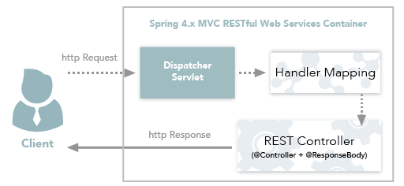

## Controller와 RestController 차이

### Controller-View

일반 Spring MVC 에서 Controller는 보통 view를 반환합니다. 
클라이언트의 Request가 들어오면 Dispatcher Servlet이 Request를 인터셉트합니다. 
Controller는 요청을 처리 후 응답을 다시 Dispatcher Servlet으로 반환하고, Dispatcher Servlet은 View를 클라이언트에게 반환한다.

  

### Controller-Data

Controller는 View 뿐만이 아니라 Data도 반환할 d수 있으며, 이때에 @ResponseBody라는 어노테이션을 사용한다.

  

### RestController

@RestController는 Spring MVC Controller에 @ResponseBody가 추가된 것이다. 마찬가지로 Json 형태로 객체 데이터를 반환하는것이 주용도이다. Spring boot를 API 서버로 활용할 때 주로 사용한다.

Spring4.0부터는 @Controller의 데이터반환과정이 @RestController로 더욱 단순화 되었다는 차이점이 있다.

 
 

## Request의 Flow cycle

- @Controller - view  
  `Client -> Request -> Dispatcher Servlet -> Handler Mapping -> Controller -> View -> Dispatcher Servlet -> Response -> Client`

 

- @Controller - Data (@ResponseBody의 실행 흐름)  
  `Client -> Request -> Dispatcher Servlet -> Handler Mapping -> Controller (ResponseBody) -> Response -> Client`

 

- @RestController의 실행 흐름  
  `Client -> HTTP Request -> Dispatcher Servlet -> Handler Mapping -> RestController (자동 ResponseBody 추가) -> HTTP Response -> Client`

 
 
 

## 결론

RestAPI만을 사용하는 컨트롤러라면 -> @RestController 
View와 Data 반환을 같이 쓰거나, View만 사용하려면 -> @Controller 
@RestController는 스프링 4.x 이상부터 @Controller와 @ResponseBody를 간단화시킨 로직이다.

참고 :

> https://devham76.github.io/spring/Spring-controllerRestController https://mangkyu.tistory.com/49

#### 읽어주셔서 감사합니다.🖐
