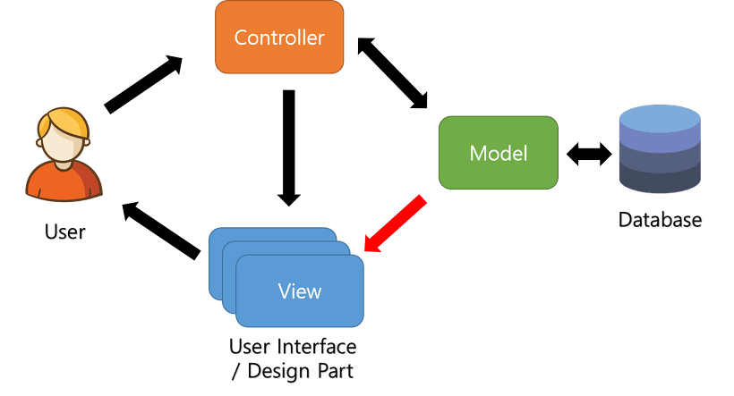
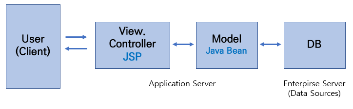
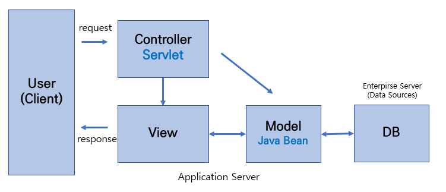

<br>
<br>
<br>
<br>

## 서론

스프링 개발자인 저로서는 사실 블로그의 제일 첫번째로 포스팅했어야할 글인데요.<br>
늦었지만 스프링 프레임워크에 대해 포스팅해보겠습니다.

스프링 프레임워크는 자바 엔터프라이즈 어플리케이션 개발의 단연 최고자리를 차지하는 프레임워크입니다.(엔터프라이즈 개발이란 기업을 대상으로 하는 개발, 즉 대규모 개발을 의미합니다)

스프링 프레임워크는 대략 20여가지 구성으로 이루어져있습니다. (주니어 분들은 스프링부트, 스프링 클라우드, 스프링 데이터, 스프링 배치, 스프링 시큐리티에 중점을 두면 될 것 같습니다.)

> (https://spring.io/projects/spring-framework)

이러한 모듈들은 스프링의 핵심기능(DI, AOP, IoC)을 제공해주며, 필요한 모듈만 선택하여 사용가능합니다.

현재 단일 아키텍처(모놀리스) 마이크로서비스 아키텍처로 변환중에 있고, 이에 맞춰서 스프링도 진화하고 있는 상태라고 합니다.

<br>
<br>
<br>
<br>

## 스프링 프레임워크란?

스프링 프레임워크의 정의는 다음과 같습니다.

- 자바(JAVA) 플랫폼을 위한 오픈소스(Open Source) 어플리케이션 프레임워크
- 자바 엔터프라이즈 개발을 편하게 해주는 오픈 소스 경량급 애플리케이션 프레임워크
- 자바 개발을 위한 프레임워크로 종속 객체를 생성해주고, 조립해주는 도구
- POJO(Plain Old Java Object) BEAN CONTAINNER

스프링 프레임워크는 자바 객체를 직접 관리하며, 객체의 생명주기/라이프사이클을 관리해줍니다.
개발자는 사용할 객체를 직접 생성하기보다는 스프링 컨테이너에 맡겨두고 필요할때만 받아올 수 있습니다.
제어의 역전(IoC, 개발자가 아닌 스프링FW에 제어권을 넘김), 의존성주입(DI, 각 계층이나 서비스간에 의존성이 존재할 경우 연결시켜줌),
관점지향프로그래밍(AOP, 트랜잭션이나 로깅, 보안과 같은 모듈을 관리) 등의 기능들을 제공해 주는 <br>
그야말로 엄청난 **자바웹개발 특급도우미** 인 셈입니다.

<br>
<br>

스프링 프레임워크가 등장하기 전의 자바 웹개발은 그야말로 웹서버에 필요한 기능들을 하나하나 개발자가 작성하여야 했습니다.
Controller, Servlet, DispatcherServlet, HandlerMapping 등을 모두 일일이 만들어주고 관리해주어야 했습니다.
개발자 자신이 컨테이너인 셈이지요.

<br>
<br>

하지만 스프링 프레임워크가 생기고 나서는 이러한 세세한 설정들은 설정파일로 바뀌거나, 클래스 파일이 현저하게 줄어들고, 객체생성을 직접하지 않아도 되므로 코드가 매우 깔끔해졌습니다.
그야말로 개발자는 프레임워크라는 도구 안에서 비즈니스로직에만 집중할 수 있게끔 된 셈이지요.

<br>
<br>
<br>
<br>

## 스프링의 핵심 요소

흔히들 스프링의 3대 핵심요소라고 하는 IoC, DI, AOP를 알아보겠습니다.

- **IoC(Inversion Of Control) : 제어의 역전** <br>
  스프링에서는 일반적인 Java 객체를 new로 생성하여 개발자가 관리하는 것이 아니라 Spring Container에 모두 맡겨버립니다. 즉, 관리주체가 개발자가 아닌 프레임워크로 넘어가는 것이므로 이를 **제어의 역전** , IoC라고 표현합니다.

  <br>
  <br>

- **DI(Dependency Injection) : 의존성주입** <br>
  위에서 설명한 스프링 프레임워크의 관리주체인 컨테이너가 바로 의존성을 개발자가 사용할 클래스에 주입을 해주게 되며, 이를 DI라는 개념으로 부르고 있습니다.
  스프링 컨테이너(IoC container)는 프로젝트에서 사용되는 객체들을 Bean으로 관리하고있고 @Autowired/@Qualifier나, @Inject, @Resource 등의 어노테이션을 통해 객체를 주입할 수 있습니다.

  <br>

  **의존성주입의 장점**

  1. 의존 관계 설정이 컴파일시가 아닌 실행시에 이루어져 모듈들간의 결합도를 낮출 수 있습니다.
  2. 코드 재사용을 높여서 작성된 모듈을 여러 곳에서 소스코드의 수정 없이 사용할 수 있습니다.
  3. 모의 객체 등을 이용한 단위 테스트의 편의성을 높여줍니다.

  <br>

  의존성 주입은 **3가지 경우로 분류**할 수 있습니다.

  **1. 생성자 주입**

  ```java
  /**
  * Constructor Injection
  */
  @Controller
  public class BookController {

    private final BookRepository bookRepository;

    public BookController(BookRepository bookRepository) {
        this.bookRepository = bookRepository;
    }

  }
  ```

  생성자 주입은 생성자에 의존성 주입을 받고자 하는 field를 나열하는 방법으로, 권고되는 방법의 하나 입니다.
  필수적으로 사용해야 하는 레퍼런스 없이는 인스턴스를 만들지 못하도록 강제하는 장점이 있습니다.

  <br>

  **2. 필드 주입**

  ```Java
  /**
  * Field Injection
  */
  @Controller
  public class BookController {

      @Autowired
      private BookRepository bookRepository;

  }
  ```

  가장 간단한 선언 방식입니다. 하지만, 의존 관계가 눈에 잘 보이지 않아 추상적이고, 이로 인해 의존성 관계가 과도하게 복잡해질 수 있다는 단점이 있습니다.

  <br>

  **3. Setter 주입**

  ```java
  /**
  * Setter Injection
  */
  @Controller
  public class BookController {

      private BookRepository bookRepository;

      @Autowired
      public void setBookRepository(BookRepository bookRepository) {
          this.bookRepository = bookRepository;
      }

  }
  ```

  setter 메서드에 @Autowired annotation을 선언하여 주입받는 방법입니다.<br>
  생성자에 모든 의존성을 기술하면 과도하게 복잡해질 수 있는 것을 선택적으로 나눠 주입 할 수 있게 부담을 덜어주는 장점이 있습니다.

  <br>

- **AOP(Aspect Oriented Programming) : 관점 지향 프로그래밍**

  AOP(Aspect Oriented Programming)란 말 그대로 관점 지향 프로그래밍입니다.<br>
  대부분 소프트웨어 개발 프로세스에서 사용하는 방법은 OOP(Object Oriented Programming) 입니다.
  OOP는 객체지향 원칙에 따라 관심사가 같은 데이터를 한곳에 모아 분리하고 낮은 결합도를 갖게하여 독립적이고 유연한 모듈로 캡슐화를 하는 것을 일컫습니다. 하지만 이러한 과정 중 중복된 코드들이 많아지고 가독성, 확장성, 유지보수성을 떨어 뜨립니다. 이러한 문제를 보완하기 위해 나온 것이 AOP입니다.
  AOP에서는 핵심기능과 공통기능을 분리시켜 핵심 로직에 영향을 끼치지 않게 공통기능을 끼워 넣는 개발 형태 이며 이렇게 개발함에 따라 무분별하게 중복되는 코드를 한 곳에 모아 중복 되는 코드를 제거 할 수 있어지고 공통기능을 한 곳에 보관함으로써 공통 기능 하나의 수정으로 모든 핵심기능들의 공통기능을 수정 할 수 있어 효율적인 유지보수가 가능하며 재활용성이 극대화됩니다.
  물론 AOP로 만들 수 있는 기능은 OOP로 구현 할 수 있는 기능이지만 Spring에서는 AOP를 편리하게 사용 할 수 있도록 이를 지원하고 있습니다.

  <br>

  AOP는 핵심기능과 공통기능을 분리시켜 핵심 로직에 영향을 끼치지 않게 공통기능을 끼워 넣는 개발 형태입니다. 무분별하게 중복되는 코드를 한 곳에 모아 제거 할 수 있고 공통기능을 한 곳에 보관함으로써 공통 기능 하나의 수정으로 모든 핵심기능들의 공통기능을 수정 할 수 있어서, 효율적인 유지보수가 가능하며 재활용성이 극대화됩니다.

  <br>

  주로 `로깅`이나 `트랜잭션`, `보안` 쪽의 기능들을 많이 AOP 방식으로 사용합니다.

  <br>
  <br>
  <br>
  <br>

## 스프링의 MVC 패턴

스프링은 MVC(Model-View-Controller) 패턴을 따르고 있습니다.



**-- View** <br>

View는 사용자에게 보여지는 인터페이스입니다.
사용자가 필요로 하는 어플리케이션의 상태나 및 데이터를 표현하는 곳입니다.

<br>
<br>

**-- Model** <br>

모든 데이터, 상태 및 어플리케이션 로직이 들어있습니다.
어플리케이션의 정보나 데이터, DB 등을 포함합니다.

<br>
<br>

**-- Controller** <br>

데이터와 비즈니스 로직 사이의 상호 동작을 관리합니다. 즉, 모델과 뷰를 통제합니다.
Controller에서는 View에 받은 요청을 가공하여 Model(Service 영역)에 이를 전달합니다.
또한 Model로 부터 받은 결과를 View로 넘겨주는 역할을 합니다.
Controller에서는 모든 요청 에러와 모델 에러를 처리하며 View와 Controller에 정보를 알고 있어야 합니다.

<br>
<br>
<br>
<br>

### MVC1 VS MVC2

<br>
<br>

#### -- MVC1



과거에는 MVC1 모델이라는 것이 존재했습니다. View와 Controller를 모두 JSP가 담당하는 형태입니다.
JSP 하나만으로 유저의 요청을 받고 응답을 처리하므로 구현난이도는 쉬운 편입니다.

단순한 프로젝트에는 괜찮겠지만 대규모 프로젝트에는 적합하지 않습니다.
JSP 하나에서 MVC가 모두 이루어지다보니 재사용성도 떨어지고, 가독성도 매우 길어지는 단점이 있습니다.
유지보수측면에서 아주 끔찍한 구조입니다.

<br>
<br>

#### -- MVC2



MVC2 패턴은 널리 스프링의 표준으로 사용되는 패턴입니다. 요청을 하나의 컨트롤러(Servlet)가 먼저 받습니다. 즉 MVC1과는 다르게 Controller, View가 분리되어 있습니다. 결합도를 낮춘 셈입니다. 따라서 역할이 분리되어 MVC1패턴에서의 단점을 보완할 수 있습니다. 그러므로 개발자는 M, V, C 중에서 수정해야 할 부분이 있다면, 그것만 꺼내어 수정하면 됩니다. 따라서 유지보수에 있어서도 큰 이점을 가집니다.

MVC2는 MVC1 패턴보다 구조가 복잡해질 수 있지만, 개발자가 이러한 세부적인 구성까지 신경쓰지 않을 수 있도록 각종 프레임워크들이 지금까지 잘 발전되어 왔습니다. 그 중에서 대표적인 것이 바로 스프링 프레임워크입니다.

<br>
<br>
<br>
<br>

## 스프링 버전별 간략 특징 정리

SpringFramework 2.5 - annotation 기반의 설정<br>
SpringFramework 3.0 - Java5 지원, RestAPI 지원 추가<br>
SpringFramework 4.0 - Java8 지원, @RestController 탄생, WebSocket지원, 테스트환경개선(Mock을 위한 ServletContext 별도 지원)<br>
SpringFramework 5.0 - Java8+/9 이상 지원, Spring WebFlux(Reactive programming) 추가<br>

<br>
<br>
<br>
<br>

다음 포스팅에서는 이 MVC2 모델을 기반으로 한 스프링 프레임워크의 Request Life Cycle 을 포스팅해보도록 하겠습니다.

<br>
<br>
<br>
<br>

참고사이트 :

> https://fastcampus.co.kr/ <br> https://aws-diary.tistory.com/13 <br> https://baek.dev/post/21/ <br> https://chanhuiseok.github.io/posts/spring-3/ <br> https://jins-dev.tistory.com/entry/Spring-Framework-%EC%9D%98-%ED%8A%B9%EC%A7%95%EA%B3%BC-%EB%B2%84%EC%A0%84%EB%B3%84-%EC%A3%BC%EC%9A%94-Feature-%EB%93%A4

#### 읽어주셔서 감사합니다.🖐
