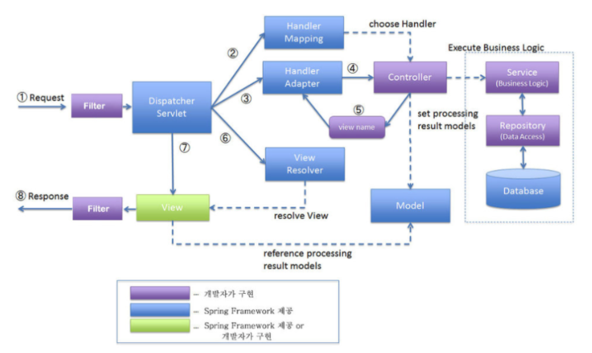

 
 
 
 

## 서론

스프링에서 요청이 어떻게 처리되는지 구조적으로 파악하고 있는 것은 아주 중요합니다. 
이 순환구조만 잘 파악하더라도 쉽게 스프링에 입문하실 수 있다고 확신합니다. 

이 순환구조를 모르신다면, 스프링 전체 구조를 파악하지 않은 상태에서 주어진 부분만 처리하는 **Coder** 일 확률이 높습니다.(~~Coder가 아니라, Programmer가 되도록 노력합시다~~) 

저도 스프링 입문했을때에 이 Request Life cycle 구조를 모른채로 마구잡이로 덤비다가 엄청난 시간소모를 겪은 경험이 있습니다. 
스프링이라는 복잡한 프레임워크의 길을 알려주는 `지도(map)`라고 생각하시고 반드시 확실하게 짚고 넘어가봅시다.

 
 
 
 

## Recycle Life Cycle

클라이언트에서 요청이 웹서버로 도착을 하고, 다시 웹서버는 요청을 처리하여 클라이언트에게 반환시키는 과정을 도식화해보겠습니다.

 
 

### Request to Response

클라이언트가 서버로 요청을 보냄. 
-> `Filter`를 거침(ex. character encoding)  
-> `DispatcherServlet`이 요청을 가로챔.  
-> `HandlerMapping` 요청을 처리할 `Controller`를 검색 후 `DispatcherServlet`에 돌려줌.  
-> `DispatcherServlet`은 실행할 `Controller` 정보를 `HandlerAdapter`에 전달  
-> `HandlerAdapter` 는 해당 `Controller` 호출  
-> `Controller`는 `Service` 호출  
-> `Service`에서 DAO 처리(DB접근 or 엔진 호출 등등) 혹은 기타 가공  
-> 요청처리 후 결과를 `Model`에 담음  
-> `View`의 이름을 `HandlerAdapter`에 전달  
-> 다시 `DispatcherServlet`으로 전달 후 `ViewResolver`를 통해 매핑된 `View`를 찾아 반환  
-> 반환된 `View`에게 `Filter`를 거쳐 `Response` 전달  

 

이 복잡한 과정을 단순화시키면 다음과 같습니다.

 

> Filter -> DispatcherServlet -> HandlerMapping -> HandlerInterceptor -> Controller -> Service -> Repository -> Controller -> ViewResolver -> DispatcherServlet -> View-> Filter

 
 
 
 

## 각 모듈들의 역할

 

### Filter

- 필터라는 단어에서 유추할 수 있듯이, 전체적인 필터링을 하는 곳입니다.
- DipatcherServlet에 들어가기 전인 Web Application단에서 실행됩니다.(스프링FW관여X, 예를 들면 톰캣의 server.xml에서 조작가능)

 

### DispatcherServlet

- Front-Controller 라고도 불립니다.
- 요청이 들어오고 나갈때를 모두 주관하는 서블릿입니다.
- HandlerMapping에게 Request에 대해 매핑할 Controller 검색을 요청합니다.
- HandlerMapping으로부터 Controller 정보를 받아 해당 Controller로 요청을 보냅니다.
- Request에 대해 어느 Controller로 매핑할지 배치하는 **배치담당자**입니다.

 

### HandlerMapping

- DispatcherServlet으로부터 검색을 요청받은 Controller를 찾아 정보를 리턴해주는 역할입니다.
- 이를 구현한 RequestMappingHandlerMapping 같은 경우는 개발자가 @RequestMapping 어노테이션을 적용한 것을 기준으로 판단합니다.

 

### HandlerInterceptor

- Request가 Controller에 매핑되기전 앞단에서 부가적인 로직을 끼워넣습니다.
- Filter와 비슷하지만 다른 점은 **영역**입니다.   Filter는 Spring의 권한밖이기 때문에 Spring Context에 접근하기 어렵지만, Interceptor의 경우 Spring의 영역 안이기 때문에 Spring Context에 접근할 수 있습니다.
- 주로 세션, 쿠키, 권한 인증 로직에 많이 사용됩니다.

 

### Controller

- Request와 매핑되는 곳입니다.(@Controller -> @RequestMapping)
- Request에 대해 어떤 로직(Service)으로 처리할 것인지를 결정하고, 그에 맞는 Service를 호출합니다.(@Service 검색)
- Service Bean을 스프링 컨테이너로부터 주입받아야 합니다. Service Bean의 메소드를 호출해야 하기 떄문입니다.
- 기본적으로 view를 반환하지만, @ResponseBody 를 통해 데이터를 반환할 수도 있습니다. 이 때는 ObjectMapper를 통해 객체형태가 JSON 형태로 전환됩니다.  (스프링4.0부터는 @RestController 라는 기능으로 대체되었습니다.)

 

### Service

- 스프링 구조에서 비즈니스 로직에 해당합니다.
- @Service, 데이터 처리 및 가공을 위한 비즈니스 로직을 수행하는 곳입니다.
- Request에 대한 실질적인 로직을 수행하기 때문에, Spring MVC Request Lifecycle의 심장이라고 볼 수 있습니다. Service가 없다면 WAS(Web Application Server)의 존재이유도 없다고 볼 수 있겠습니다.
- Repository(@Repository)를 통해 DB에 접근하여 데이터의 CRUD(Create, Read, Update, Delete)를 처리하는 곳입니다.

 

### Repository

- 스프링 구조에서 비즈니스 로직에 해당합니다.
- DB에 접근하는 객체입니다. DAO(Data Access Object) 라고 부릅니다. 주로 Mapper 클래스의 어노테이션으로 사용됩니다.
- Service에서 DB에 접근할 수 있게 하여 데이터의 CRUD를 할 수 있게 도와줍니다.

 

### ViewResolver

- Controller에서 리턴한 View의 이름을 DispatcherServlet으로부터 넘겨받고, 해당 View를 렌더링합니다.
- 렌더링한 View는 DispatcherServlet으로 리턴하고, DispatcherServlet에서는 해당 View 화면을 Response 합니다.

##### 생각해 볼 점

- 데이터만 리턴하는 RestAPI 형태의 서버는 ViewResolver가 필요하지 않습니다.

 
 
 
 

참고사이트 :

> https://velog.io/@damiano1027/Spring-Spring-MVC-Request-Lifecycle   https://sas-study.tistory.com/224

#### 읽어주셔서 감사합니다.🖐
