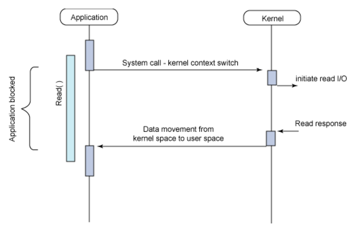
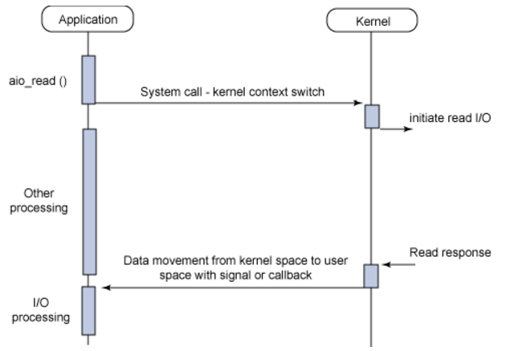

 
 
 
 

## 서론

회사에서 업무적으로 도입을 준비하는 과정에 공부하게 된 내용을 공유합니다.
많은 동시성을 처리하는 MSA 구조에서 도메인 단위의 마이크로서비스에 적용하기 좋은 기술스택인 것 같습니다.
코드 예시보다는 스프링 웹플럭스의 소개와 장/단점 위주로 포스팅해보려 합니다.

 
 
 
 
 
 

## 1. 스프링 웹플럭스는 무엇인가?

 

`웹플럭스`는 Spring5(2017년)에 새롭게 추가된 Reactive-stack의 웹 프레임워크입니다.
기존의 Servlet 기반 Spring MVC의 단점을 해소하고자 만들어진 모듈입니다.
주로 Non-Blocking과 함수형 프로그래밍, reactive stream의 구현 등에 초점을 맞추고 있으며, 의존관계가 Srping MVC와는 많이 달라져서 같이 사용하기 어렵습니다.
`웹플럭스`의 핵심인 `Non-Blocking`을 이해하기 위해서는 기존 SpringMVC에서 어떻게 `Blocking`을 하면서 요청들을 처리했었는지 이해할 필요가 있습니다.

 

### 1-1. Blocking I/O

가장 기본적인 I/O모델입니다. I/O요청(DB, 파일입출력, 네트워킹)을 한 후 요청을 받아 완료되기 전까지는 Application의 쓰레드는 Block 상태이기 때문에 다른 작업을 수행할 수 없습니다. 즉, 비효율적입니다.

하지만 기존의 Spring MVC 구조에서 큰 불편함(?)을 느끼진 못했을 것입니다.
왜냐하면 자바는 Multi Thread로 동작하기 때문에, 작업하던 Thread가 Block되는 순간 다른 Thread가 어플리케이션의 다른 작업을 처리하기 위해 동작함으로써 크게 눈치채지 못한 것입니다.
하지만 Thread간의 전환(Context Switching)을 할 때 비용이 발생하므로 다량의 요청이 쏟아지는 구조의 서버입장에서 낭비가 발생합니다.

요청이 1개 들어와서 응답이 오기전까지 작업을 시작한 Thread는 블락(대기)해야 합니다.
그 말인즉슨, 요청이 오는 족족 Thread가 뛰어나가 요청을 맞이해야 합니다.
Thread Pool에 생성된 모든 Thread가 요청을 맞이하기 위해 동작하고 있는 경우, 초과하는 요청은 Queue에 쌓이게 되고,
이 때부터는 _**Thread Pool Hell**_ 이라고 하는 모든 요청의 지연구간이 발생하게 됩니다.

 
 

### 1-2. Asynchronous Non-blocking I/O

그림만 보더라도 Blocking I/O 대비 요청/응답이 심플하게 이어집니다.
Thread는 요청 후, 다른 작업에 투입됩니다. 응답이 오면 이벤트가 발생하여 알려주거나, 미리 등록해놓은 구독자(Subscriber)를 통해 작업이 진행됩니다.

적은 Thread로도 Blocking I/O대비 많은 동시성을 처리할 수 있기 때문에 네트워킹 I/O가 활발한 MSA구조에서 다량의 동시성 요청들을 처리하기에 적합합니다.

바로 `웹플럭스`는 이러한 비동기 `Non-Blocking` 방식이기 때문에 이벤트 루프가 돌면서 이벤트가 발생할 경우 그것에 맞는 핸들러에게 처리를 넘기고 처리가 완료되면 callback 메소드 등을 통해 응답을 반홥합니다. 여기서 요청이 이벤트에 해당합니다.

하지만 내부 동작이 `Non-Blocking`이더라도 DB 커넥션, 네트워킹 I/O가 Blocking 구조라면 웹플럭스의 성능을 최대로 끌어낼 수 없을 겁니다.
경우에 따라선 Spring MVC보다 더 느리게 동작할 수도 있을 것입니다.
그래서 DB, 네트워킹I/O 또한 `Non-Blocking`을 지원하는 `gRPC`나 `WebClient`, DB 커넥션은 `R2DBC`(Reactive Relational Database Connectivity)와 같은 프레임웍, 툴의 도움을 받아야 합니다.

 
 
 
 
 

## 2. 왜 업무에서 웹플럭스를 도입하게 되었는가?

 

마이크로서비스 환경에서 개발하면서 서버간 통신을 자바단에서는 `RestTemplate`을 통해 진행하였습니다.
하지만 곧 Deprecated 될 예정이었고, 권장스펙인 `WebClient`를 사용하게 되면서 자바랭귀지에서의 비동기에 대해서 눈을 뜨게 되었습니다.(~~다른 팀원들이 그렇다는게 아니라 저만~~).
또한 대량의 요청이 들어오는 마이크로서비스를 개선하기 위한 여러 개선책을 찾던 도중 비동기라는 개념을 자연스럽게 접하게 되면서 `웹플럭스`에 대한 호기심으로 이어지게 되었습니다.

 

또한, 토큰 방식의 인증시스템을 도입하게 되며 인증쪽 서비스의 동시성 이슈에 대한 다양한 도전을 받게 되었습니다.
해당 서비스의 네트워킹 방식을 다량의 트래픽에 유리한 gRPC방식으로 바꾸게 되면서, 어디가 끝인지 모를 끝없는 Scale-Up/Scale-Out 으로부터 어느정도 자유로워지긴 했습니다.

 

하지만 거기서 만족하지 못하고 기술적 갈증과 해당 서비스의 여러가지 조건이 웹플럭스를 도입하기에 적당하다는 판단을 하게 되면서 JPA 구조에서 `R2DBC`를 기반으로 하는 `Non-Blocking` 구조 도입을 결심하게 되었습니다.(~~제가 아니라 팀원 모두의 결정으로~~)

 
 
 
 
 

## 3. 웹플럭스는 어떻게 쓰는거지?

 

웹플럭스 사용을 위한 의존성설정은 어떻고, 프로퍼티 설정은 어떻게 해야하는지보다는 **개념위주**로 **간단히** 설명해보겠습니다.

우선 웹플럭스는 `Event Driven` 방식이므로 `Event Loop`를 활용한 데이터의 흐름이 중요합니다.
이를 위해 Publish/Subscribe 개념이 필요합니다.
`Publishing` 과정을 통해 이벤트를 요청하고 처리하기 위한 입구를 열어놓고, 데이터를 구독하기 위한 `Subscribe`를 등록해야지만 데이터가 방출되고 가공되며 구독되는 일련의 데이터 스트림이 생성되게 됩니다.

 

데이터 스트림에서 제어되는 데이터는 Mono<>와 Flux<> 형태를 가집니다.

- Mono : 0~1개의 결과를 처리.
- Flux : 0~N개의 결과를 처리.
- 둘 다 에러를 포함.

 
 
 
 
 

## 4. 웹플럭스 사용 시 주의할 점.

 
 

### 4-1. Block 이 한 곳이라도 존재한다면?

- 웹플럭스는 이벤트루프 기반이기에 블락이 존재한다면 나머지 쓰레드들마저 블락이 끝날때까지 줄세워야 합니다.
- Spring MVC보다 더 성능이 떨어질 수 있기때문에 (~~어쩔 수 없는 상황이라면 별도의 쓰레드풀을 통해 커스텀 핸들링해야하지만 그래도~~) 절대 비추입니다.

 

### 4-2. WebFilter

- 웹플럭스에서 필터와 인터셉터 기능을 사용하려면 `WebFilter` 클래스를 이용해야 합니다.

 

### 4-3. Block 검출을 위한 BlockHound

- 테스트 환경을 위한 Blocking Call 검출 툴인 `BlockHound`를 사용하면 개발 시 발견하지 못했던 블락킹구간을 쉽게 발견할 수 있습니다.
  - `Blockhound`를 사용하면 블락킹 부분에서 예외를 발생시킵니다.
  - 당연히 별도의 감시 툴이기 때문에 운영환경에서 사용 시 성능의 하락을 불러옵니다.
  - 더 자세한 글은 아래 블로그가 잘 설명해주는 듯 합니다.
    > [스프링 웹플럭스(Spring WebFlux) 에서 블록하운드(BlockHound) 사용하기](https://velog.io/@adduci/%EC%8A%A4%ED%94%84%EB%A7%81-%EC%9B%B9%ED%94%8C%EB%9F%AD%EC%8A%A4Spring-WebFlux-%EC%97%90%EC%84%9C-%EB%B8%94%EB%A1%9D%ED%95%98%EC%9A%B4%EB%93%9CBlockHound-%EC%82%AC%EC%9A%A9%ED%95%98%EA%B8%B0)

 

### 4-4. 성능이 좋으니 무조건 WebFlux를 사용해야 할까?

 

 

- 그림을 보면 Spring MVC와 Spring 웹플럭스 둘 다 성능이 동일한 구간이 존재합니다. 요청이 많지 않을 경우에 오히려 Spring MVC가 코드유지의 간편함, 유지보수성, 가독성, 디버깅 편이 등의 이유로 웹플럭스에 비해 여러모로 장점이 많을 수도 있습니다. 이 구간에서는 오히려 Spring MVC가 높은 생산성을 가지게 된다는 말입니다.
   
- trade off를 잘 선택해야 합니다.
   
- 앞서 이야기했듯이, 대량의 요청이 들어오는 경우에 그리고 서버의 성능이 좋을수록 J커브를 그리는 구간의 기울기가 커지게 될 것입니다.

 
 
 
 

참고사이트 :

> https://velog.io/@adduci/%EC%8A%A4%ED%94%84%EB%A7%81-%EC%9B%B9%ED%94%8C%EB%9F%AD%EC%8A%A4Spring-WebFlux-%EC%97%90%EC%84%9C-%EB%B8%94%EB%A1%9D%ED%95%98%EC%9A%B4%EB%93%9CBlockHound-%EC%82%AC%EC%9A%A9%ED%95%98%EA%B8%B0   https://ckddn9496.tistory.com/158   https://alwayspr.tistory.com/44   https://thalals.tistory.com/381   https://namu.wiki/w/Spring(%ED%94%84%EB%A0%88%EC%9E%84%EC%9B%8C%ED%81%AC)

#### 읽어주셔서 감사합니다.🖐
