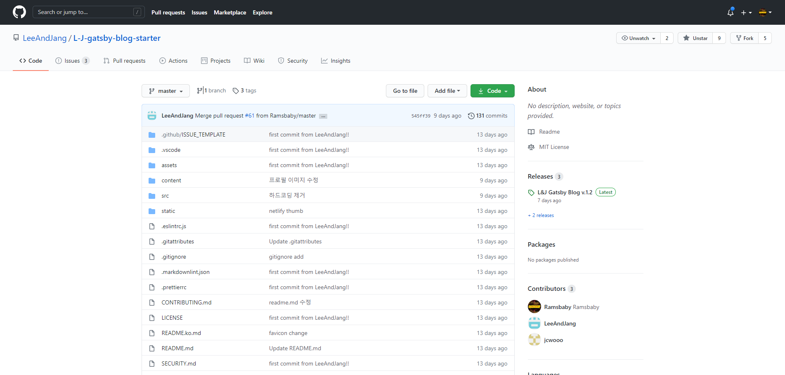
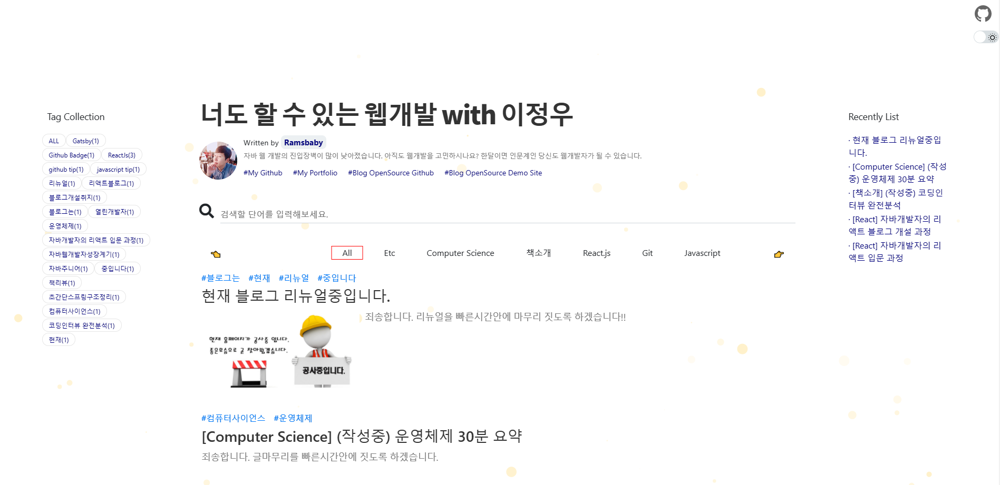
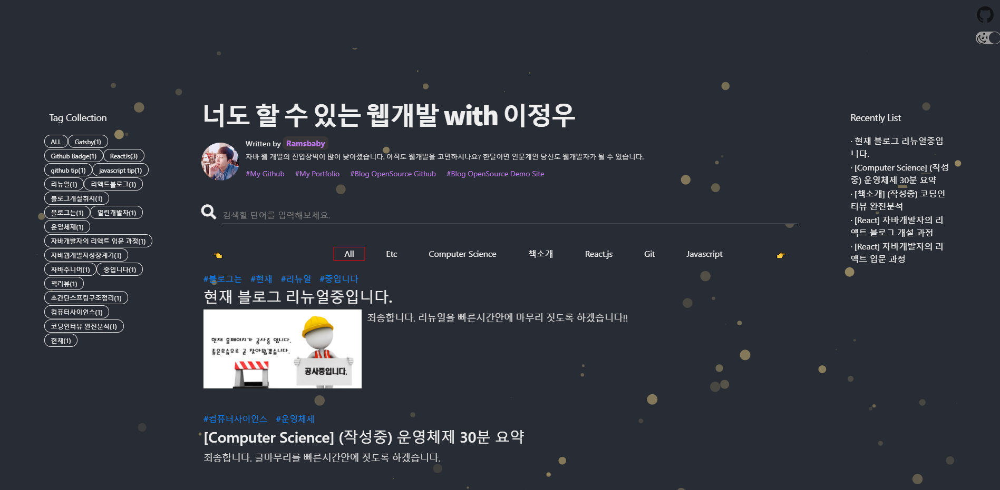

  

### 1. 잡설

**안녕하세요**, 퇴사 후 오랜 여행과 여유와 자유시간을 즐기고 ~~개발 늪~~ 아니아니, 개발 오픈월드로 돌아온
여러분의 **람스베이비** 입니다. 🖐 (~~제주도 여행을 4박5일로 한라산등정까지...읍읍~~)

제가 오랫동안 바래오던 오픈소스 기여에 드디어 발돋움을 하였습니다. 🎈

지금 보고계시는 블로그 프로젝트를 이제 제 개인 깃허브 계정에서 **공식 깃허브 계정**으로 옮겨서 오픈을 하였습니다.

작년 2020년 6월부터 개인적으로 리액트 공부를 진행하며, 사이드 프로젝트로 진행해오던 블로그 프로젝트가 드디어 많은 작업을 거쳐서 지금의 모습으로 재탄생하였습니다.

혼자 진행하기엔 벅찬 감이 있어서, 열심히 개발중이던 다른 개발자 ~~호구~~ 친구 한명을 꼬드겨서 **리앤장 갯츠비 블로그 스타터** 라는 약간 긴 이름의 오픈소스 프로젝트를 시작하게 되었습니다.

  

### 2. 좌표

> [공식 깃허브](https://github.com/LeeAndJang/L-J-gatsby-blog-starter) 는 https://github.com/LeeAndJang/L-J-gatsby-blog-starter 이고,
>   [데모사이트](https://l-j-gatsby-blog-starter.netlify.app/) 는 https://l-j-gatsby-blog-starter.netlify.app/ 이곳입니다.

누구나 손쉽게 클론하셔서 블로그를 쉽게 운영해볼 수 있도록 위의 깃허브 주소의 Readme.md를 작성하였습니다.
세부적인 설치절차 혹은 헷갈릴 만한 부분들은 따로 데모사이트에서 상세하게 작성해보려 합니다.

  

### 3. 이 블로그의 장점은?

- 저희 블로그는 핫한 프론트 프레임워크인 `React.js` 와 정적페이지생성기인 `Gatsby.js`, 그리고 배포와 서버운영을 무료로 제공하는 `Netlify` 라는 클라우드 서비스를 기본적으로 제공합니다.  
- 최신 웹 표준을 따르고 있으며 `lazy load`, `image blur load`, 깃허브와 연동한 무중단 배포서비스, 유료로 제공되지만 나만의 이름을 가진 도메인서비스 또한 제공하고 있습니다.  
- 포탈사이트에서 내 블로그와 게시글들이 상단에 표시할 수 있도록 SEO(Search Engine Optimization)또한 간단히 적용할 수 있습니다.  
- 간단한 환경구성 후 마크다운 파일만 작성하여 유지보수 및 개발작업 없이 비개발자 또한 리액트 블로그를 운영해볼 수 있습니다.  

  

### 4. 누가 쓰나

2021년 3월 10일 현재, 10여명 정도의 개발자 혹은 비개발자분들께서 포크 혹은 클론을 받아서 제 블로그를 운영중에 있습니다.

  

### 5. 포부

앞으로 건의사항, 이슈사항 등은 [깃허브 이슈목록](https://github.com/LeeAndJang/L-J-gatsby-blog-starter/issues) 이 곳에서 의견 주시면 적극 반영하도록 하겠습니다.

물론 오픈소스이니, 누구나 저희 소스를 리팩토링 혹은 버그를 수정하여 혹은 이러한 컴포넌트가 있으면 좋겠던데~ 하는 **순수한** 마음으로 Pull Request를 제출해주시면 최대한 빠르게 검토 후 블로그에 반영하여 오픈소스 컨트리뷰터로 참여하실 수 있으시구요.

계속 발전해 나가는 꾸준한 모습으로 **자주** 찾아뵙도록 하겠습니다. 감사합니다.

  
  

  

#### 읽어주셔서 감사합니다.🖐
