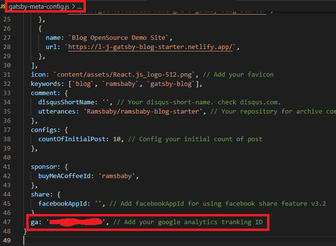
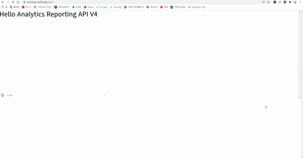

### 1. 서론

저희 블로그에서는 gatsby-meta-config.js 파일의 ga 변수를 통해 아주 간단하게 구글 애널리틱스와 연동할 수 있습니다.

이렇게 연동을 하면 [구글 애널리틱스](https://analytics.google.com/)에 접속하여 해당 사이트의 접속자수, 세션수, 접속자 접속 시간, 사이트 유입 검색어 등등의 유용한 데이터들을 시각적으로 확인할 수 있습니다. 

아... 하지만, 이 얼마나 불편한 일입니까? 이 사이트의 통계를 다른 사이트를 접속하여 확인을 하여야 한다는 점이 말이죠. 

그래서 저는 저의 블로그에 통계 수치를 확인할 수 있는 관리자 페이지를 만들기로 결심했습니다.

  

### 2. 도입할 API 찾기

관리자 페이지를 구축하기에 앞서, 당연히 주축 서비스가 될 통계데이터를 API를 통해서 가져와야 할것입니다. 있을겁입니다. 그런 Open API는. 확고한 믿음으로 검색한 결과,  
구글신에 검색 후, 구글 애널리틱스에서 구글 애널리틱스 리포트라는 Open API를 제공하는 것을 확인하였습니다. **개발자에겐 아주 편리한 세상입니다. 너무 좋습니다.**  
저는 이 블로그에 [Google Analytics Reporting API V4](https://developers.google.com/analytics/devguides/reporting/core/v4) 라는 Open API를 도입하여 관리자페이지에서 이 블로그에 대한 유용한 통계치를 제공하기로 결심했습니다.

  

### 3. API 연동 TEST

1. 문제점1 (API연동 에러)

   - 해당 사이트에서는 자바스크립트에 대한 가이드 소스가 있었습니다. HTML 파일을 통해 필요한 라이브러리를 HTML 파일의 `<head>` 태그에 있는 `<script>` 호출을 통해 가져오고 있었습니다.
   - 블로그 내에서 테스트 페이지를 만든 후 샘플 소스에 있는 API 함수를 호출하였으나, 접근이 되질 않습니다. 왜냐하면, 이 Gatsby 블로그에서는 일반적인 HTML 파일 호출과는 다르게 자바스크립트의 export나 JSX파일의 return값을 통해 컴포넌트를 페이지에 로딩하는 방식이기 때문입니다.
   - `<HTML>` 이라는 컴포넌트를 export 하는 구조에서는 `<script>` 태그가 페이지 로딩보다 먼저 선언되지 않는 방식인 것을 여러 시간의 삽질끝에야 알았습니다. 😢
   - 여러가지 시행착오 끝에 페이지가 로딩되고 난 후, 최종적으로 HTML 컴포넌트가 로딩되는 구조라면 당연히 샘플코드에 있는 함수선언식의 자바스크립트 메소드는 빌드 과정에서 에러가 나는 것이 당연하다고 판단되어졌습니다. 아직 export될 `<HTML>`태그의 `<head>` 안에 있는 `<script>`가 로딩되지 않은 채로 함수를 호출하려 했으니 말이죠.
   - 해결책은 간단했습니다. 함수선언식의 메소드를 함수표현식으로 바꾸어 자바스크립트의 호이스팅(최상단 호출순서로 끌어올려지는 현상)을 회피하는 식으로 에러를 해결하였습니다.

 

2. 문제점2 (권한획득 난해함)
   - 해당 API의 함수들을 호출하기 위해서는 구글계정에 대한 접근이 필요하였습니다. 구글에서 제공하는 OAuth 토큰을 통하여 계정권한을 획득하는 일이었는데요. 이 또한 만만치가 않았습니다.
   - https://console.developers.google.com/ 사이트에 접속 후 프로젝트를 만들고, API 사용설정, 해당 API 사용승인 등을 통한 과정이 필요했는데요. 저는 시행착오를 겪었지만, 가이드문서를 쉽게 만들어서 이 오픈소스를 이용하는 사람들이 쉽게 권한을 획득할 수 있도록 쉽게 문서화하는 과정이 필요함을 느꼈습니다.
   - 구글 계정 권한을 쉽게 획득하기 위해 `react-google-login` 라는 npm 모듈을 이용하였습니다. 구글 로그인 버튼을 두고, 해당 모듈을 호출하여 로그인과정을 통해 구글계정권한을 캐쉬에 두고, 이 권한을 이용하여 구글 애널리틱스 API 호출이 가능하게끔 하는 구조이죠.   말은 어려워 보이지만, 어찌어찌 하다보니 되더군요.(~~설명포기~~)

  

### 4. API 연동 성공

자 이러이러한 시행착오들 끝에 드디어 API 연동을 성공한 화면입니다.

네, 제 블로그에 접속한 사용자들의 수를 Google Analytics 사이트에서 가져오는 화면입니다.

이 **소중한 데이터**들을 저는 **_데이터 시각화 기법_**을 통해, 블로그를 운영할 사용자들에게 **예쁘게** 표현해줄 예정입니다.

별거 없어 보이지만, 서비스 구현에 앞서 핵심 서비스의 중요 기능을 구현해보는 것은 아주 중요한 일입니다.(~~생각해보니 너무 당연한 말이네요~~)아무튼 잘됬군요.

다음 게시글에서는 저 소중한 데이터를 예쁘게 꾸며보는 과정을 여러분에게 보여드리겠습니다.

  

#### 읽어주셔서 감사합니다.🖐
