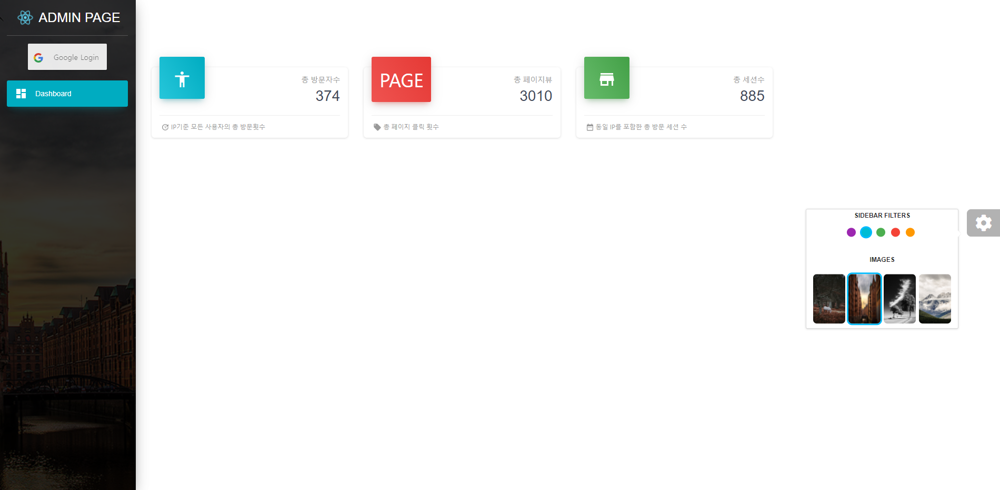

### 1. Material-ui 도입

리액트js를 이용한 손쉬운 UI Framework를 찾던 도중, `(antd)ant design`과 `material-ui` 이 두가지 UI 툴에 관심이 생겼습니다. `antd`를 도입하려고 이것저것 설치하며 테스트해본 결과, 온통 중국어 투성이여서 2중 번역을 하더라도 번거로움이 상당했습니다. 하여 영어로 된 `material-ui`를 도입하기로 결정하였습니다.

<br><br>

### 2. 관리자 페이지 도입



위와 같이 관리자페이지 샘플을 발견하여 갯츠비에 페이지를 할당해주었습니다.
이전 포스팅에서 다루었던 Google Analytics API를 이용한 데이터 결과값들을 `material-ui` 컴포넌트를 이용하여 적절히 표현해 보았습니다.

별도의 페이지에 있는 데이터를 담기 위해서 Context API를 이용하여 전역변수 처리하였고, 로그인과 동시에 결과값이 성공적으로 전달받아지면, '구글로그인에 성공하였습니다' 메시지와 함께 화면이 표출되는 방식입니다.

아래 코드는 방문자수, 페이지수, 세션수를 요청하는 리퀘스트 소스입니다.

```javascript
gapi.client
  .request({
    path: '/v4/reports:batchGet',
    root: 'https://analyticsreporting.googleapis.com/',
    method: 'POST',
    body: {
      reportRequests: [
        {
          viewId: VIEW_ID,
          dateRanges: [
            {
              startDate: '2020-01-01',
              endDate: 'today',
            },
          ],
          metrics: [
            { expression: 'ga:users' },
            { expression: 'ga:pageviews' },
            { expression: 'ga:sessions' },
          ],
        },
      ],
    },
  })
  .then(displayResults, console.error.bind(console))
```

<br><br>

### 3. 앞으로

현재는 간단하게 방문자수, 세션수, 페이지수만 표현하고 있습니다. 하지만 이외에 유용한 데이터들을 더 가져올수 있도록 개선 예정입니다.

<br>

그리고 현재 저의 개인 블로그에만 적용되어있으나, 오픈소스 블로그에도 조만간 github를 통해 배포할 예정입니다. 🤔

<br><br>

#### 읽어주셔서 감사합니다.🖐
