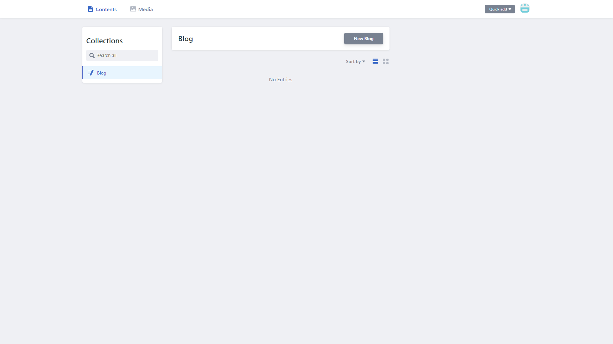
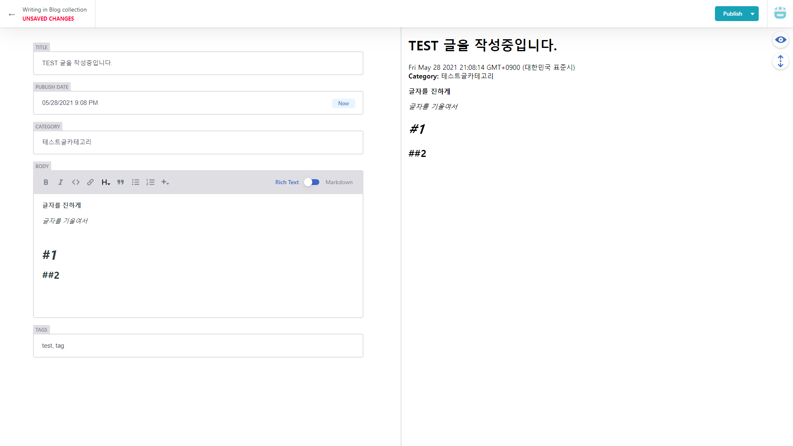
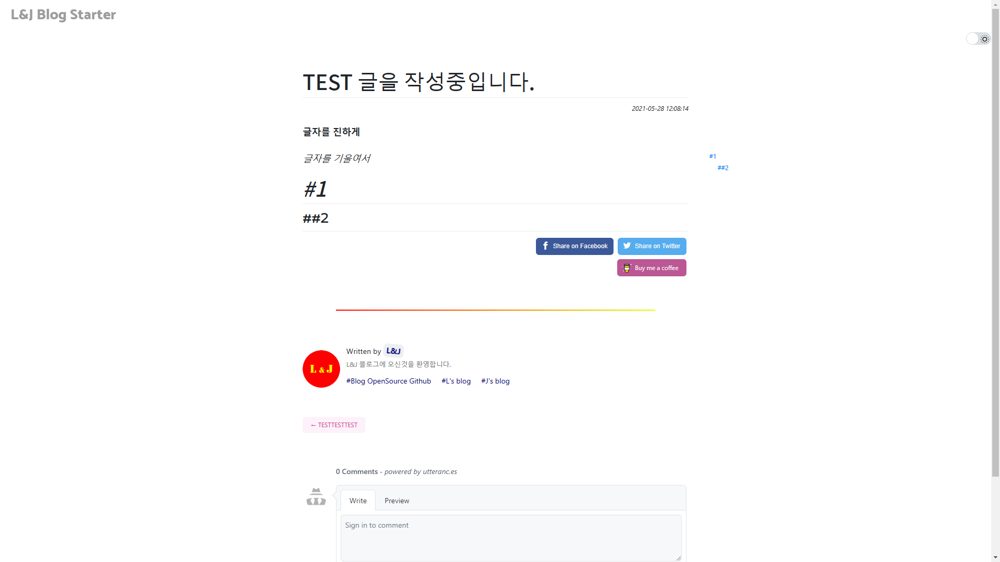

 
 
 
 

> CMS 도입 관련 블로그 오픈소스 배포글 :   https://l-j-gatsby-blog-starter.netlify.app/manual/manual_netlify_cms/

 
 
 
 

### 서론

문득, 비개발자도 VSC를 거치지 않고 글을 쓸 수 있는 기능이 있어야겠다고 생각이 들었습니다.
여러가지로 검색해본 결과 몇 줄의 코드만 추가하면 Gatsby에서 Netlify-CMS(Content Management System)을 사용할 수 있다는 것을 발견했습니다.

 
 
 
 

## 어떻게 도입?

https://www.netlifycms.org/docs/add-to-your-site/
위의 공식사이트에서 quick guide 를 통해 적용해 본 결과, 아주 간단한 설정만으로도 CMS기능을 사용할 수 있게 되었습니다.

 
 
 
 

## 어떻게 사용?

일단 여러가지 템플릿이 있으나, 제일 기본 템플릿을 이용했습니다.  
아래와 같은 페이지들이며, 간단 설명은

> https://l-j-gatsby-blog-starter.netlify.app/manual/manual_netlify_cms/

사이트에 작성해 두었습니다.

 
 
 
 

참고사이트 :

> https://www.netlifycms.org/docs/intro/   https://cms-demo.netlify.com/   https://jeesoo.work/netlify-cms/

#### 읽어주셔서 감사합니다.🖐
