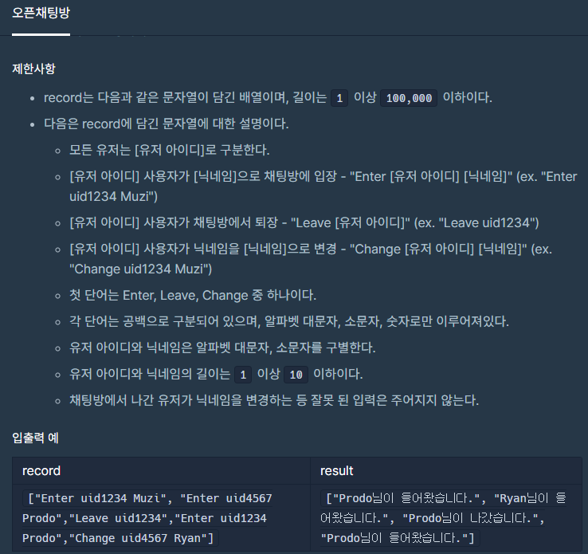

<br>
<br>
<br>
<br>

## 문제간단설명



오픈카톡방에 사용자가 들어오고, 나가는 과정을 메시지로 남겨라 입니다.
사용자는 아이디를 변경해서 들어올 수 있고, 들어온 뒤 변경할 수도 있습니다.
변경해서 들어오는 경우와 들어와서 변경하는 경우, 과거의 메시지들에서 사용자의 닉네임이 모두 변경되어야 한다는 조건이 있습니다.

<br>
<br>
<br>
<br>

## 해결전략

유저리스트 배열과 메시지리스트 배열을 사용하여 해결하였습니다.
유저리스트는 아이디와 닉네임관리를 위해서, 메시지리스트는 사용자가 입장/퇴장하는 기록을 시간순서대로 기록하기 위해서 생성하였습니다.

<br>
<br>
<br>
<br>

## 문제점

자바스크립트 배열메소드 중 하나인 find를 이용해서 유저리스트 전체를 검색하는 코드를 짰으나, 시간초과 라는 문제에 부딪혔습니다.
인덱스접근 방법은 시간이 오래 걸릴 수 있기에 dictionary 기법으로 key, value 형태의 소스로 바꾸어 시간문제를 해결했습니다.

<br>
<br>
<br>
<br>

## 나의 코드

```javascript
//JavaScript
function solution(record) {
  let answer = [],
    userList = [],
    messageList = []

  record.map(d => {
    let item = d.split(' ')

    if (item[0] == 'Enter') {
      userList[item[1]] = item[2]
      messageList.push({ userId: item[1], type: item[0] })
    } else if (item[0] === 'Leave') {
      messageList.push({ userId: item[1], type: item[0] })
    } else if (item[0] === 'Change') {
      userList[item[1]] = item[2]
    }
  })

  answer = messageList.map(d => {
    let str = userList[d.userId] + '님이 '
    str += d.type === 'Enter' ? '들어왔습니다.' : '나갔습니다.'
    return str
  })

  return answer
}
```

```JAVA
//JAVA
static class Solution{
  private String[] answer;
  private HashMap<String, String> userIdMap = new HashMap<String, String>();

  public String[] solution(String[] str){
      for(String message:str){
          String[] messageArr = message.split(" ");

          if(messageArr[0].equals("Leave") == false)
              userIdMap.put(messageArr[1], messageArr[2]);
      }

      ArrayList<String> arrayList = new ArrayList<>();

      for (int i = 0; i < str.length; i++) {
          String[] messageArr = str[i].split(" ");
          String action = "";
          if(messageArr[0].equals("Enter")){
              action = "들어왔습니다.";
          }
          else if(messageArr[0].equals("Leave")) {
              action = "나갔습니다.";
          }
          else if(messageArr[0].equals("Change")){
              continue;
          }

          arrayList.add(userIdMap.get(messageArr[1]) + "님이 " + action);
      }

      answer = new String[arrayList.size()];
      answer = arrayList.toArray(new String[arrayList.size()]);
      return answer;
  }

  public static void main(String[] args){
      Solution s = new Solution();
      s.solution(new String[]{"Enter uid1234 Muzi", "Enter uid4567 Prodo","Leave uid1234","Enter uid1234 Prodo","Change uid4567 Ryan"});
  }
}
```

#### 읽어주셔서 감사합니다.🖐
