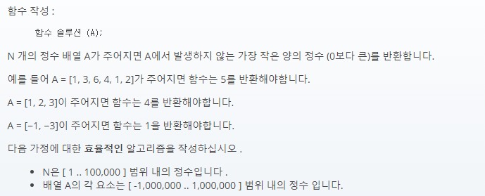

## 문제간단설명



- **배열의 비어있는 양의 정수 원소 중 최솟값을 구하라.** <br>

주어진 배열의 원소들 중 가장 최솟값을 구하는 문제입니다. <br>
비어있지 않다면 최댓값+1 을 리턴, 음수들로 이루어져있다면 양수의 최솟값인 1을 리턴하는 조건이 주어져 있습니다.

<br>
<br>
<br>
<br>

## 해결전략

1. 중첩을 허용하지 않는 자료구조인 Set을 이용.
2. 주어진 배열의 최댓값을 구해 놓은 후, 최댓값만큼 반복문을 사용하여 최소단위부터 순차탐색을 시도합니다.
3. set안에 없는 데이터가 바로 최솟값입니다. 리턴.

<br>
<br>
<br>
<br>

## 나의 코드

```javascript
function solution(A) {
  const max = A.sort((a, b) => b - a)[0]

  const N = new Set(A)
  let answer = 0

  for (let i = 0; i <= max; i++) {
    if (N.has(i + 1) === true) continue
    else {
      answer = i + 1
      break
    }
  }

  return answer <= 0 ? 1 : answer
}
```

#### 읽어주셔서 감사합니다.🖐
