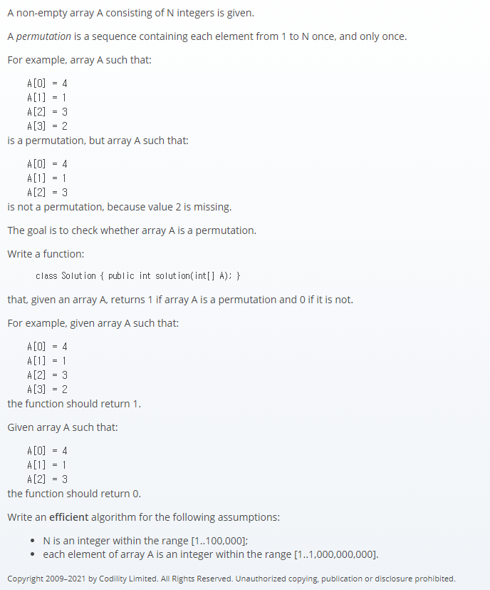

## 문제간단설명



- **배열이 순열인지 아닌지 확인하라.** <br>

해당 배열이 원소들이 배열의 갯수만큼의 순열인지 아닌지 확인하는 문제입니다.

<br>
<br>
<br>
<br>

## 해결전략

1. 중첩을 허용하지 않는 자료구조인 Set을 이용.
2. 배열의 길이만큼 반복문을 사용하여 최소단위부터 순차탐색을 시도합니다.
3. set안에 데이터가 없으면 순열조건이 아니기 때문에 0을 반환.

<br>
<br>
<br>
<br>

## 나의 코드

```javascript
function solution(A) {
  const N = A.length
  const set = new Set(A)
  let check = true

  for (let i = 1; i <= N; i++) {
    if (set.has(i) === true) continue
    else {
      check = false
      break
    }
  }

  return check ? 1 : 0
}
```

#### 읽어주셔서 감사합니다.🖐
