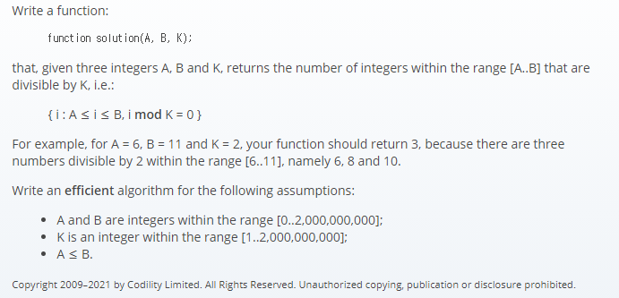

## 문제간단설명



- **주어진 범위의 정수에서 K로 나눌 수 있는 숫자의 갯수를 구하라.** <br>

주어진 범위의 정수내에서 K의 배수를 구하는 문제입니다.

<br>
<br>
<br>
<br>

## 해결전략

1. 조건문을 보면 0<=A,B<=2,000,000,000 범위로 주어져 있으므로 반복문으로 도전하면 타임아웃이 나옵니다.
2. 반복문을 배제한 채, 알고리즘 혹은 수학 공식으로 접근해야 효율성에서 감점당하지 않습니다.
3. A~B 범위 이므로 B를 K로 나눈 값의 나머지를 버린 Math.floor(B/K) 와 마찬가지로 동일하게 Math.floor((A-1)/K) 의 차를 구하면 정답이 됩니다. (A-1을 해 준 이유는, A값 또한 정답의 범위에 포함되어야 하기 때문입니다.)
4. 여기서 함정이 있는데, 0을 K로 나눈값 또한 배수에 해당됩니다. 보통 0은 배수가 아닐거라고 생각하고 넘어가기 쉽죠. (예를 들어, [0,0,11] 은 반환값이 1이어야 합니다.)

<br>
<br>
<br>
<br>

## 나의 코드

```javascript
function solution(A, B, K) {
  if (A === B && B % K === 0) return 1

  return Math.floor(B / K) - Math.floor((A - 1) / K)
}
```

#### 읽어주셔서 감사합니다.🖐
