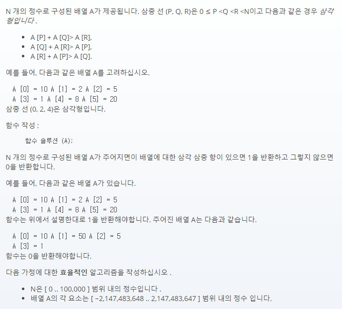

## 문제간단설명



주어진 배열 내에서 삼각형에 해당하는 삼중항이 있으면 1을 반환, 없으면 0을 반환하는 문제입니다.

A [P] + A [Q] > A [R],<br>
A [Q] + A [R] > A [P],<br>
A [R] + A [P] > A [Q].<br>

이 세 조건에 부합해야 삼각형이 형성된다는 말인데요.<br>
예시로 나온 (0, 2, 4) 삼중항을 보면 (10, 5, 8) 이라는 숫자가 삼각형이 된다는 예시입니다.<br>
즉, 배열에 주어진 요소들 중 세가지 요소를 골랐을 때, 2가지 요소의 합은 항상 남은 요소보다 커야 한다는 조건입니다.

<br>
<br>
<br>
<br>

## 해결전략

1. 배열을 오름차순으로 정렬합니다.
2. 반복문을 이용해서 A[i]+A[i+1]>A[i+2] 조건을 만족하는 요소를 찾습니다.
3. 조건을 만족하는 요소의 개수를 구하는 것이 아니기 때문에, 발견 즉시 반복문을 종료합니다.

<br>
<br>
<br>
<br>

## 나의 코드

```javascript
function solution(A) {
  let arr = A.slice()
  let answer = 0
  arr = arr.sort((a, b) => a - b)

  for (let i = 0; i < arr.length; i++) {
    if (i === arr.length - 2) break

    if (arr[i] + arr[i + 1] > arr[i + 2]) {
      answer++
      break
    }
  }

  return answer
}
```

#### 읽어주셔서 감사합니다.🖐
