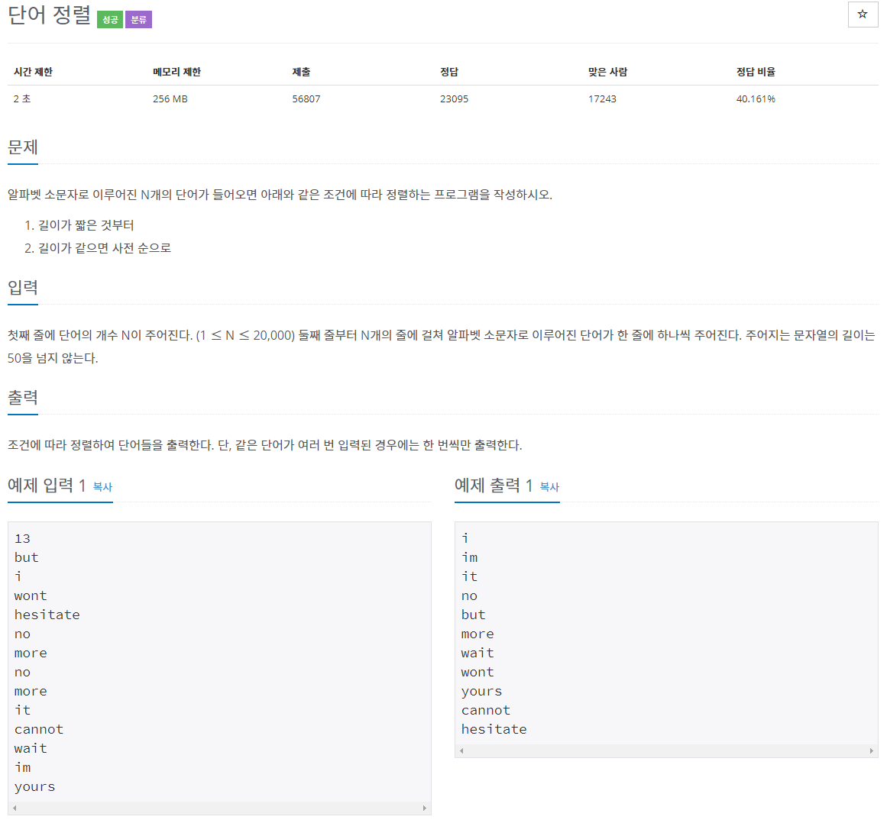

## 문제간단설명



문자열들을 입력받았을 때, 문자열들을 길이 순으로 출력하는 문제입니다. <br>
만약 길이가 같은 단어가 나오면 사전 순으로 정렬하는 조건이 있습니다.

<br>
<br>
<br>
<br>

## 해결전략

1. stream 이용하여 중복을 제거합니다. (distinct())
2. 길이순으로 정렬합니다. (sorted())
3. 길이가 같으면 사전순으로 정렬합니다.
4. 출력

<br>
<br>
<br>
<br>

## 나의 코드

```java
import java.io.*;
import java.util.Arrays;
import java.util.StringTokenizer;

public class Main {
    //백준 1181번 - 단어정렬
    static FastReader scan = new FastReader();
    static StringBuilder sb = new StringBuilder();


    public static void main(String[] args) {
        int N = scan.nextInt();
        String[] str = new String[N];

        //문자열 입력받기
        for(int i=0; i<N; i++) str[i] = scan.nextLine();

        //stream이용
        //1.중복제거
        //2.길이 순 정렬(같은 길이는 사전순 정렬)
        //3.출력
        Arrays.stream(str).distinct().sorted((a,b)-> {
            if(a.length() == b.length()){
                return a.compareTo(b);
            }
            return a.length() - b.length();
        }).forEach(System.out::println);
    }

    static class FastReader {...}
}
```

#### 읽어주셔서 감사합니다.🖐
