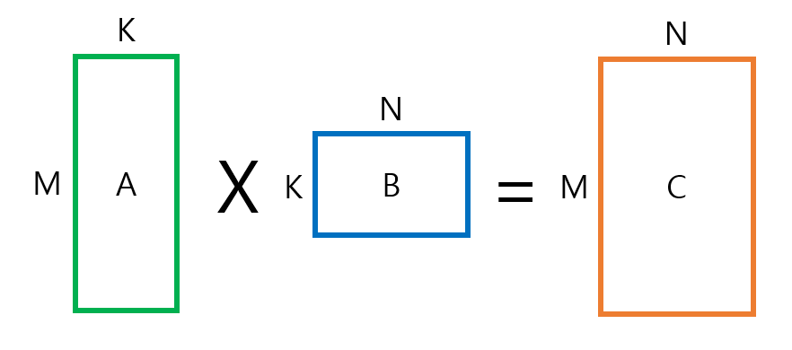
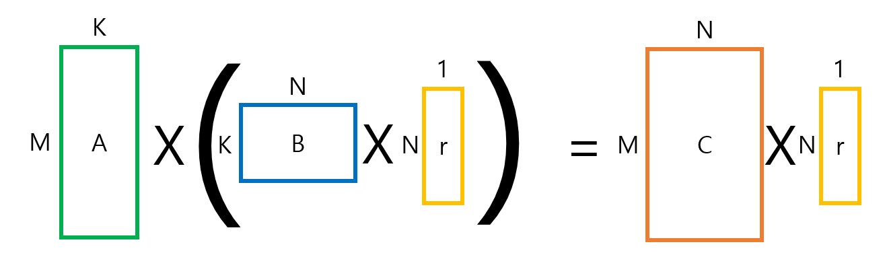
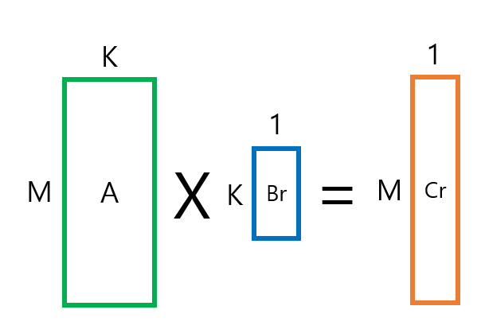
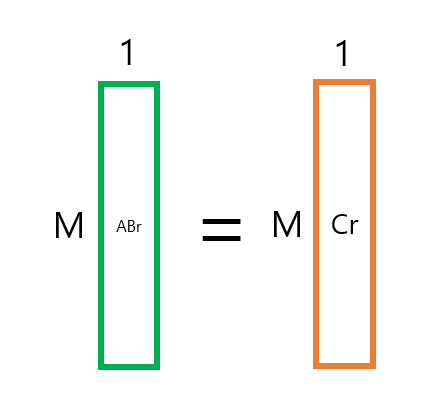

<br>
<br>
<br>
<br>

## 알고리즘 설명

`Freivalds Algorithm`은 행렬곱에 대해 O(N²)의 시간을 제공하는 알고리즘입니다. <br>

일반 행렬 곱셈을 이용하면 O(N³)의 시간이 걸리고,
더 빠른 행렬곱 방식을 이용하더라도 O(N^2.3727)의 시간이 걸리게 됩니다.

`Freivalds Algorithm`은 행렬 A,B 그리고 C가 있을때 AB = C 가 True인지, False인지를 열벡터를 곱해 차가 0인지 확인하는 방법입니다.

<br>
<br>
<br>
<br>

## 일반 행렬곱 방식



일반 행렬곱은 위와 같습니다.

<br>
<br>
<br>
<br>

## 프리발즈 알고리즘 방식







프리발즈 방식은 다음과 같습니다.
AB = C 인지 판별하기 위해서 양쪽에 1과 0으로 이루어진 무작위 열벡터 r을 곱합니다.
A(Br) = Cr 상태를 만든 후
A(Br) - Cr = 0 인지를 판별합니다.

<br>
<br>
<br>
<br>

## 코드 구현

```JAVA
class GFG {
    public static double[][] multiply(double[][] a, double[][] b, int n)
    //행렬곱 로직
    {
        //열벡터만 곱할 예정
        double result[][] = new double[n][1];

        for (int i = 0; i < n; i++) {
            for (int j = 0; j < 1; j++) {
                for (int k = 0; k < n; k++) {
                    result[i][j] = result[i][j] + a[i][k] * b[i][j];
                }
            }
        }
        return result;
    }

}

@SpringBootApplication
public class DemoApplication {

    public static void main(String[] args) {
        SpringApplication.run(DemoApplication.class, args);

        Scanner input = new Scanner(System.in);

        System.out.println("행렬 차수 입력:");
        int n = input.nextInt();

        // 차수입력
        System.out.println("좌항 첫번째 행렬 입력:");

        // 첫번째 행렬
        double a[][] = new double[n][n];

        for (int i = 0; i < n; i++) {
            for (int j = 0; j < n; j++) {
                a[i][j] = input.nextDouble();
            }
        }

        System.out.println("좌항 두번째 행렬 입력:");
        double b[][] = new double[n][n];

        // 두번째 행렬
        for (int i = 0; i < n; i++) {
            for (int j = 0; j < n; j++) {
                b[i][j] = input.nextDouble();
            }
        }

        // 우항 행렬
        System.out.println("우항 행렬");
        double c[][] = new double[n][n];

        for (int i = 0; i < n; i++) {
            for (int j = 0; j < n; j++) {
                c[i][j] = input.nextDouble();
            }
        }

        // 0과 1로 이루어진 열벡터 생성
        double[][] r = new double[n][1];
        Random random = new Random();
        for (int i = 0; i < n; i++) {
            r[i][0] = random.nextInt(2);
        }

        // 행렬*열벡터 결과 확인
        double br[][] = new double[n][1];
        double cr[][] = new double[n][1];
        double abr[][] = new double[n][1];
        br = multiply(b, r, n);
        cr = multiply(c, r, n);
        abr = multiply(a, br, n);

        // true/false 확인용 변수 선언
        boolean flag = true;

        // A(Br) - cr = 0 인지 확인
        for (int i = 0; i < n; i++) {
            if (abr[i][0] - cr[i][0] == 0)
                continue;
            else
                flag = false;
        }

        // true/ false 여부 출력
        if (flag == true)

            System.out.println("true!");
        else
            System.out.println("false!");

        input.close();
    }
}
```

<br>
<br>
<br>
<br>

참고 :

> https://en.wikipedia.org/wiki/Freivalds%27_algorithm <br> https://velog.io/@springkim/Algorithm-Freivalds-Algorithm <br> https://www.geeksforgeeks.org/freivalds-algorithm/

#### 읽어주셔서 감사합니다.🖐
