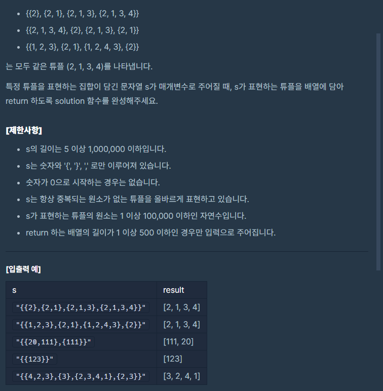

## 문제간단설명


특정 튜플을 표현하는 집합이 담긴 문자열 s를 받았을때, s가 표현하는 튜플로 변경하여 return 하시오.

<br>
<br>
<br>
<br>

## 해결전략

1. 입력받은 집합기호로 둘러싸인 문자열을 비교가능한 배열로 변경
2. dicitionary 기법을 이용해서 같은 값이 나올때마다 해당 key값의 value값 증가시켜줌.
3. value값을 기준으로 sorting 후 return

<br>
<br>
<br>
<br>

## 문제점

2단계에서 가장 쉬운문제라 딱히 문제점은 없었으나, 너무 어렵게 푼 건 아닌가 하는 생각이 듭니다. 더 쉽게도 가능할듯한데...

<br>
<br>
<br>
<br>

## 나의 코드

```javascript
function solution(s) {
  let answer = []
  let temp,
    dict = []

  //원형데이터 보존을 위한 깊은 복사
  temp = s.slice()

  //문제 설명이 좀 애매한데 가장 많이 나오는 원소가 앞에 오는듯.

  //집합기호 해체 후 비교를 위한 배열로 변경.
  temp = temp.substr(1, temp.length).substr(0, temp.length - 2)
  temp = temp
    .replace(/{/gi, '[')
    .replace(/}/gi, ']')
    .substr(1, temp.length)
    .substr(0, temp.length - 2)
    .split('],[')

  //dictionary 기법 이용, 같은값 나올때마다 해당 key값의 value값 증가시켜주기
  temp.map(d => {
    const arr = d.split(',')

    arr.map(dd => {
      if (dict[dd] !== undefined) dict[dd]++
      else if (dict[dd] === undefined) dict[dd] = 1
    })
  })

  //value sorting 위해 value값을 [0], key값을 [1]로 변경
  for (const item in dict) {
    answer.push([item, dict[item]])
  }

  //value순으로 sort 후 [0] 요소만 숫자로 변경 후 담기
  answer = answer
    .sort(function(a, b) {
      return b[1] - a[1]
    })
    .map(d => d[0] * 1)

  return answer
}
```

#### 읽어주셔서 감사합니다.🖐
