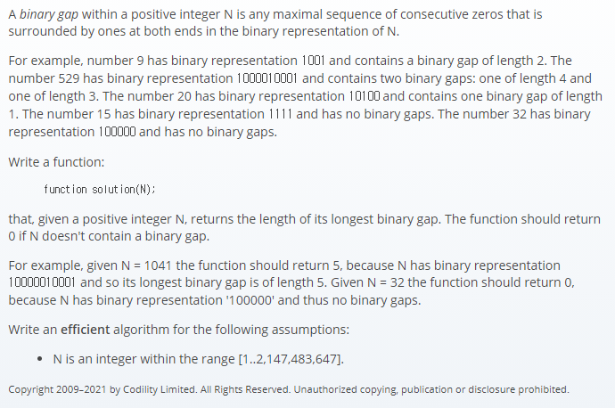

## 문제간단설명


입력받은 숫자를 2진수로 바꾸고, 1과 1사이의 0의 갯수인 이진간격을 구하라.

<br>
<br>
<br>
<br>

## 해결전략

1. 숫자를 이진수로 변경
2. 이진수 문자열을 기준으로 for문을 건 후, 1과 1사이의 0의 갯수를 카운팅
3. answer list에 값을 추가해주며 마지막에 제일 큰 수 반환.

<br>
<br>
<br>
<br>

## 문제점

딱히 문제는 없었으나, 코딩테스트 문제를 많이 풀어보지 못해서 간단한 문제를 어렵게 푸는 것이 습관이 되어 있었습니다. 문제를 풀고나니, 코드도 조잡한 것 같고, 해결방법도 너무 복잡하게 생각한 것 같아서 다시 한번 고민을 해보았습니다.

<br>
<br>
<br>
<br>

## 다른 방법 고민

이 문제의 포인트는 2진수로 변환된 데이터의 1과 1사이의 0의 갯수만 구하면 되므로, indexOf를 사용하면 굳이 요소간 비교를 할 필요가 없다는 생각이 들었습니다.

> **역시 해결했다고 넘어갈 것이 아니라,** <br> **더 좋은 방법이 있는지 확인해보는 습관이 중요하다는 것을 깨달았습니다.**

<br>
<br>
<br>
<br>

## 원래 코드

```javascript
function solution(N) {
  //입력값의 최댓값 최솟값 지정
  if (N >= 2147483647 || N === 1) return 0

  //2진수 변환
  let bin = N.toString(2)
  let answer = []
  let cnt = 0

  for (let i = 0; i < bin.length; i++) {
    if (i === bin.length - 1) {
      //마지막 요소는 셀필요 없음.
      break
    } else if (bin[i] === '1') {
      //1을 만날경우 answer list 다음 요소로 이동
      cnt++
      answer[cnt] = 0 //초기화
    } else if (bin[i] === '0') {
      //0을 만날경우 answer list ++
      answer[cnt]++
    }
  }

  //10000 인 경우는 1과 1사이가 성립하지 않으므로 0 리턴
  if (cnt === 1 && bin.charAt(bin.length - 1) === '0') return 0
  //1000100 인 경우 카운트 대상이 되는 1과 1사이의 0의 갯수는 1개여야 하므로 마지막요소 제거
  else if (cnt !== 1 && bin.charAt(bin.length - 1) === '0') {
    answer.pop()
  }

  //오름차순 정렬 후 제일 큰 카운트 숫자 리턴
  return answer.sort((a, b) => b - a)[0]
}
```

<br>
<br>
<br>
<br>

## 자아성찰 후 수정한 코드

```javascript
function solution(N) {
  //입력값의 최댓값 최솟값 지정
  if (N >= 2147483647 || N === 1) return 0

  //2진수 변환
  let bin = N.toString(2)
  let answer = []
  let pos = bin.indexOf('1')
  if (bin.indexOf('1', pos + 1) === -1) return 0

  //다음 1을 찾지 못하면 종료
  while (pos !== -1) {
    if (bin.indexOf('1', pos + 1) !== -1) {
      answer.push(bin.indexOf('1', pos + 1) - bin.indexOf('1', pos) - 1)
    }

    pos = bin.indexOf('1', pos + 1)
  }

  return Math.max(...answer)
}
```

#### 읽어주셔서 감사합니다.🖐
