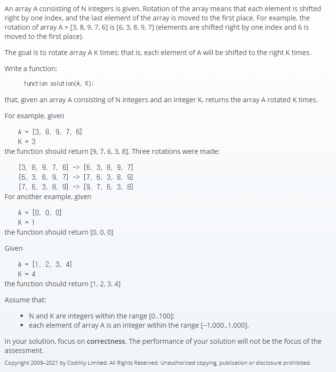

## 문제간단설명


회전하는 배열.
입력받은 K의 횟수만큼, 마지막 원소를 앞으로 이동시켜라.

<br>
<br>
<br>
<br>

## 해결전략

1. pop과 unshift 메소드를 적절히 이용.

<br>
<br>
<br>
<br>

## 문제점

개인적으로, 풀어본 코딩테스트 문제중에 제일 쉬웠습니다.

<br>
<br>
<br>
<br>

## 나의 코드

```javascript
function solution(A, K) {
  //array가 비어있다면 굳이 회전할 필요가 없으므로 바로 return
  if (arr.length === 0) return arr

  //깊은 복사
  let arr = A.slice()
  let cnt = JSON.parse(JSON.stringify(K))

  while (cnt !== 0) {
    arr.unshift(arr.pop())
    cnt--
  }

  return arr
}
```

#### 읽어주셔서 감사합니다.🖐
