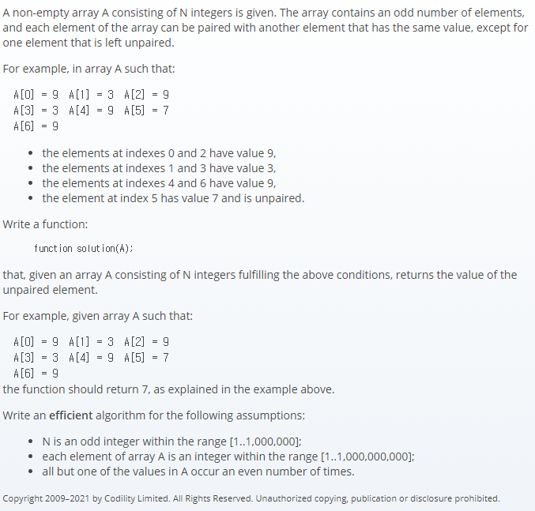

## 문제간단설명


숫자로 이루어진 홀수개의 갯수를 가진 배열을 입력받았을 때,
짝이 맞지 않는 원소를 찾아라. (예를 들어, 0번쨰와 2번째, 1번째와 3번째는 같은값이어야 한다.)

<br>
<br>
<br>
<br>

## 해결전략

1. 중복되지 않는 자료구조인 Set을 이용.
2. Set 에 값이 있으면 삭제, 없으면 Add
3. 최종적으로 남은 값은 짝이 없는 데이터이므로 반환

<br>
<br>
<br>
<br>

## 문제점

처음엔 Set을 이용하지 않고 임의로 Dictionary 기법으로 접근하였으나 O(N^2)의 시간복잡도로 인하여 Time out이 많이 나왔습니다. 배열의 indexOf 보다 Set의 has 메소드가 더 속도가 우수하다는 근거로, Set을 이용하여 문제를 해결했습니다.

<br>
<br>
<br>
<br>

## 나의 코드

```javascript
function solution(A) {
  let arr = A.slice()
  let answer = 0
  let set = new Set()

  for (let item in arr) {
    if (set.has(arr[item])) {
      set.delete(arr[item])
    } else {
      set.add(arr[item])
    }
  }

  answer = [...set][0]

  return answer
}
```

#### 읽어주셔서 감사합니다.🖐
