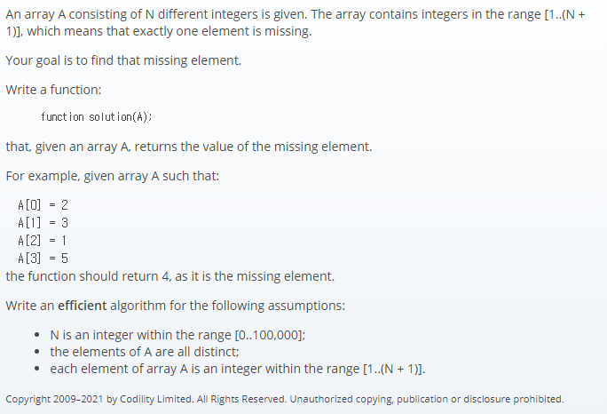

## 문제간단설명


N개의 배열을 입력값으로 받았을 때, 배열은 1~N+1 범위의 정수가 포함되어 있습니다.
누락된 하나의 요소를 찾으시오.

<br>
<br>
<br>
<br>

## 해결전략

1. 중복되지 않는 자료구조인 Set을 이용.
2. Set 에 값이 있으면 삭제, 없으면 Add
3. 최종적으로 남은 값은 누락된 요소이므로 반환

<br>
<br>
<br>
<br>

## 문제점

딱히 큰 어려움은 없었습니다.

<br>
<br>
<br>
<br>

## 나의 코드

```javascript
function solution(A) {
  let arr = A.slice()
  let set = new Set(arr)

  for (let i = 1; i <= arr.length + 1; i++) {
    if (set.has(i)) {
      set.delete(i)
    } else {
      set.add(i)
      break
    }
  }

  return [...set][0]
}
```

#### 읽어주셔서 감사합니다.🖐
