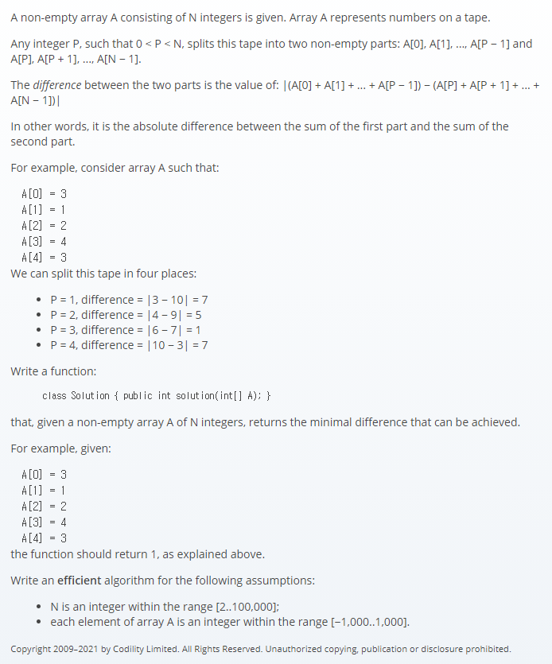

## 문제간단설명


배열이 주어질 경우, 순차적으로 첫번째 부분의 합과 남은 부분의 합의 차이를 먼저 구한 후, 그 차이값들 중 최솟값을 반환하시오.
(예를 들어, 5개의 원소로 이루어진 배열일 경우, sum(1)-sum(2~5), sum(1~2)-sum(3~5), ...)

<br>
<br>
<br>
<br>

## 첫번째 해결전략

1. 2중 반복문 사용
2. 반복문을 순회하며, 요소들의 합의 차이를 다시 반복문안에서 재계산
3. 최솟값 반환

<br>
<br>
<br>
<br>

## 문제점

정확성 검사는 통과하였으나, 시간복잡도가 O(N^N) 으로 최악의 경우가 탐지되었습니다.
반복문을 중첩해서 사용하였기에 발생한 문제였습니다.
다시 문제를 검토하던 중, 전체 합을 먼저 구한 후, 비교 대상인 leftSum 변수를 재결합하면서 totalSum 변수와 차이를 구하면, 반복문 한개만으로 처리가 되겠다 싶었습니다.

> **느낀점 : 앞으로도 불필요한 중첩반복문은 반드시 배제한 채로 문제를 풀어야겠다는 생각이 들었습니다.**

<br>
<br>
<br>
<br>

## 두번째 해결전략

1. 전체 합 최초 계산
2. 반복문을 1개만 사용하여, totalSum과 leftSum으로 나누어서 차이값 산출
3. 최솟값 반환

<br>
<br>
<br>
<br>

## 성능 문제가 발생한 코드

```javascript
function solution(A) {
  let arr = A.slice()
  let answer = 0

  if (arr.length === 2) return Math.abs(arr[0] - arr[1])

  arr.map((d, i) => {
    let item = Math.abs(sum(arr.slice(0, i)) - sum(arr.slice(i, arr.length)))

    if (i === 1) answer = item
    else if (i !== 0 && answer > item) answer = item
  })

  return answer
}

function sum(arr) {
  return arr.reduce((a, b) => a + b, 0)
}
```

<br>
<br>
<br>
<br>

## 해결된 코드

```javascript
function solution(A) {
  let arr = A.slice()

  if (arr.length === 2) return Math.abs(arr[0] - arr[1])

  let totalSum = sum(A)
  let leftSum = 0
  let answer = 0

  for (let i = 0; i < arr.length - 1; i++) {
    totalSum -= arr[i]
    leftSum += arr[i]

    if (i === 0) answer = Math.abs(leftSum - totalSum)
    if (answer > Math.abs(leftSum - totalSum))
      answer = Math.abs(leftSum - totalSum)
  }

  return answer
}

function sum(arr) {
  return arr.reduce((a, b) => a + b, 0)
}
```

#### 읽어주셔서 감사합니다.🖐
