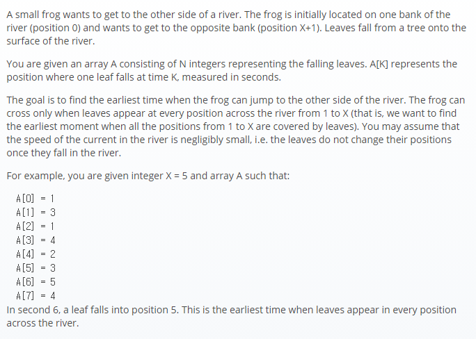

## 문제간단설명



- **개구리가 강을 건너는 최소시간을 구하라.** <br>

무작위 원소로 구성된 배열이 주어집니다. <br>
배열의 index는 시간의 흐름이며, 배열의 원소는 잎이 떨어지는 위치입니다. <br>
주어진 위치만큼 개구리는 이동해야 하지만, 잎이 없는 곳은 점프를 할 수가 없습니다. <br>
즉, 이동하고자 하는 위치까지 모든 잎이 떨어져 있어야만 이동할 수 있습니다. <br>
주어진 위치로 이동할 수 있는 최소시간을 반환할 것, 하지만 주어진 위치로 이동을 하지 못하면 -1을 반환하는 것이 문제의 핵심입니다.

<br>
<br>
<br>
<br>

## 해결전략

1. 중첩을 허용하지 않는 자료구조인 Set을 이용.
2. 주어진 배열의 원소들이 잎의 위치 목록인 set 안에 존재하면 하나씩 삭제.
3. set안에 데이터가 존재하지 않으면 성공.

<br>
<br>
<br>
<br>

## 문제점

2중 반복문 혹은 반복문 중첩으로 인한 시간복잡도가 발생하지 않았으므로, 시간복잡도는 O(N)입니다.
처음부터 문제에 적당한 자료구조인 Set을 이용하였기에 큰 문제는 없었습니다.

> **느낀점 : Testcase를 최대한 짜임새있게 만드는것이, 한번에 통과할 수 있는 지름길이라는 것을 다시 한번 깨닫게 되었습니다.**

<br>
<br>
<br>
<br>

## 나의 코드

```javascript
function solution(X, A) {
  let set = new Set()
  let answer = null

  //주어진 위치로 이동하기 위한 모든 잎의 위치를 Set에 저장합니다.
  for (let i = 1; i <= X; i++) set.add(i)

  //목적지인 X가 주어진 배열안에 없으면 점프 불가능 반환
  if (A.indexOf(X) === -1) return -1

  //주어진 배열의 원소들이 Set에 존재하면 Set의 요소 삭제
  //가고자하는 위치까지 모든 원소들이 있으면 Set의 Size는 0이 됩니다.
  //이때의 index를 반환하는 것이 목표입니다.
  for (let j = 0; j < A.length; j++) {
    if (set.has(A[j])) set.delete(A[j])

    if (set.size === 0) {
      answer = j
      break
    }
  }

  //answer가 null이라는건 중간의 어느위치가 비어있다는 뜻. 점프 불가능 반환
  return answer === null ? -1 : answer
}
```

#### 읽어주셔서 감사합니다.🖐
